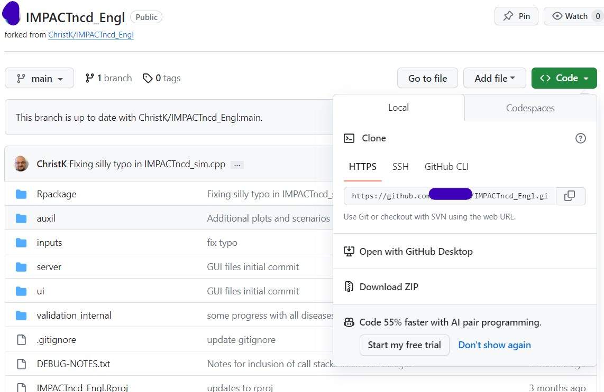

# IMPACTncd_Engl microsimulation

--------------------------------------------------------------------------------

IMPACTncd_Engl is an implementation of the IMPACTncd framework, developed by Chris
Kypridemos with contributions from Max Birkett, Karl Emmert-Fees, Anna Head, Brendan Collins, Martin O'Flaherty,
Peter Crowther (Melandra Ltd), Maria Guzman-Castillo, Amandine Robert, Piotr Bandosz, and Adithi R. Upadhya. 

Several research grants have supported its development including grants from the Health Foundation,
NIHR, EU Horizon2020, Liverpool City Council, MRC, NIH, and the National Cerebral and Cardiovascular Center in Japan.  

Copyright (C) 2018-2023 University of Liverpool, Chris Kypridemos.

IMPACTncd_Engl is free software; you can redistribute it and/or modify it under the
terms of the GNU General Public License as published by the Free Software
Foundation; either version 3 of the License, or (at your option) any later
version. This program is distributed in the hope that it will be useful, but
WITHOUT ANY WARRANTY; without even the implied warranty of MERCHANTABILITY or
FITNESS FOR A PARTICULAR PURPOSE. See the GNU General Public License for more
details. You should have received a copy of the GNU General Public License along
with this program; if not, see <http://www.gnu.org/licenses/> or write to the
Free Software Foundation, Inc., 51 Franklin Street, Fifth Floor, Boston, MA
02110-1301 USA.


## Overview

A simulation consists of *baseline* and *what-if* policy scenarios (or hypotheses). Policy scenarios typically comprise populations with *improved* risk factors, e.g. after some future health policy, 20% of the population show 

- improved body mass index (BMI), blood pressure, or cholesterol level (each by 20%).
- increased fruit and vegetable intake (by 20%).
- reduced alcohol intake (by 20%).
- reduced smoking prevalence or passive smoking (each by 20%).
- increased physical activity (by a single day).

Output data is then analysed for health improvements, e.g. in disease prevalence, incidence, or mortality. 

## Requirements

The IMPACTncd_Engl distribution is usually installed directly from [GitHub](https://github.com/ChristK/IMPACTncd_Engl/) via the [Git](https://git-scm.com/) version control system, which should be installed on the target system. While not absolutely required, Git eases installation of future updates and previous releases. While earlier versions will suffice, Git 2.40.0 was the latest at release time.

The IMPACTncd_Engl model is written primarily in, and so requires installation of, the [R programming language](https://cran.r-project.org/), for which version 4.2.3 was the latest at release time. Additional R packages (listed in `dependencies.yaml`) will be installed automatically if missing at execution time, e.g. `data.table`, `piggyback`, `foreach`.

## Installation

IMPACTncd_Engl is installed directly from GitHub, after which a model-specific configuration is set. With multiple configurations, different policy scenarios may be tested on the same server. 

### Download without GitHub

#### Downloading IMPACTncd_Engl

##### To install and run IMPACTncd_Engl we need to install R on [Windows](installation_docs/installing_R_on_windows.md) / [Linux](installation_docs/installing_R_on_linux.md); and [rtools](installation_docs/installing_rtools_on_windows.md) (only for Windows) before these following steps

1. To use IMPACTncd England navigate here: https://github.com/ChristK/IMPACTncd_Engl. 

2. Select Code on the right side corner, this will show an option of **Download ZIP**



### Download without GitHub

#### Cloning IMPACTncd_Engl

##### To install and run IMPACTncd_Engl we need to install R on [Windows](installation_docs/installing_R_on_windows.md) / [Linux](installation_docs/installing_R_on_linux.md); [Git](installation_docs/installing_git.md); and [rtools](installation_docs/installing_rtools_on_windows.md) (only for Windows) before these following steps

1. To use IMPACTncd England navigate here: https://github.com/ChristK/IMPACTncd_Engl. 

2. Select Code on the right side corner, this will present a link which can be used to download the package in local system. Copy this link


3. In terminal, type git clone https://github.com/ChristK/IMPACTncd_Engl.git (which is the copied link) 


### Modelling with IMPACTncdEngl


1. All vignettes can be viewed using the code below 

```{r}
vignette(package = "IMPACTncdEngl")
```

2. The next steps can be found in the vignette which can be accessed using the code below

```{r}
vignette("how_to_test_run", package = "IMPACTncdEngl")
```

3. Use the following code to open the vignette to run different policy scenarios

```{r}
vignette("how_to_run_scenarios", package = "IMPACTncdEngl")
```

4. Use the following code to open the vignette to understand model outputs 

```{r}
vignette("understanding_model_outputs", package = "IMPACTncdEngl")
```

5. To completely delete the package IMPACTncdEngl is explained in a section called **How to remove IMPACTncdEngl installed package** in the vignette mentioned below

```{r}
vignette("how_to_test_run", package = "IMPACTncdEngl")
```

## Further notes and references

[^policyScenario]
