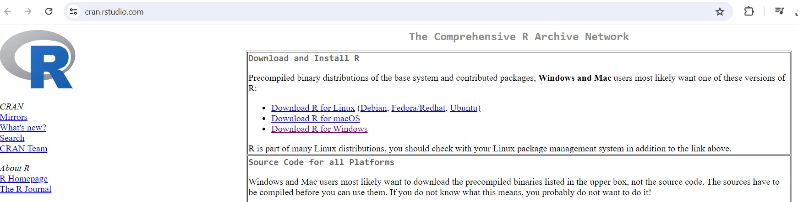
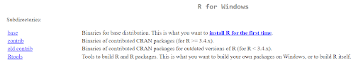
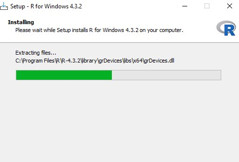
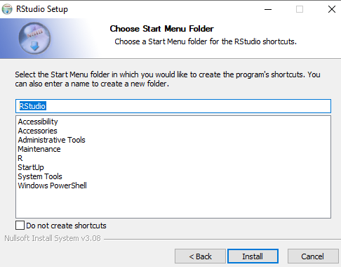
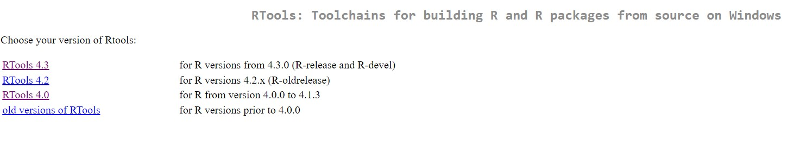
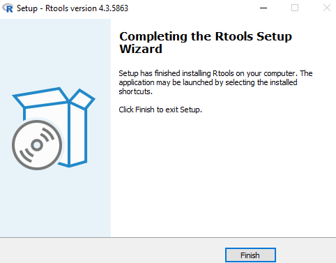
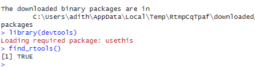
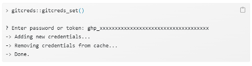

# IMPACTncd_Engl microsimulation

--------------------------------------------------------------------------------

IMPACTncd_Engl is an implementation of the IMPACTncd framework, developed by Chris
Kypridemos with contributions from Max Birkett, Karl Emmert-Fees, Anna Head, Brendan Collins, Martin O'Flaherty,
Peter Crowther (Melandra Ltd), Maria Guzman-Castillo, Amandine Robert, and Piotr Bandosz. 

Several research grants have supported its development including grants from the Health Foundation,
NIHR, EU Horizon2020, Liverpool City Council, MRC, NIH, and the National Cerebral and Cardiovascular Center in Japan.  

Copyright (C) 2018-2023 University of Liverpool, Chris Kypridemos.

IMPACTncd_Engl is free software; you can redistribute it and/or modify it under the
terms of the GNU General Public License as published by the Free Software
Foundation; either version 3 of the License, or (at your option) any later
version. This program is distributed in the hope that it will be useful, but
WITHOUT ANY WARRANTY; without even the implied warranty of MERCHANTABILITY or
FITNESS FOR A PARTICULAR PURPOSE. See the GNU General Public License for more
details. You should have received a copy of the GNU General Public License along
with this program; if not, see <http://www.gnu.org/licenses/> or write to the
Free Software Foundation, Inc., 51 Franklin Street, Fifth Floor, Boston, MA
02110-1301 USA.


## Overview

A simulation consists of *baseline* and *what-if* policy scenarios (or hypotheses). Policy scenarios typically comprise populations with *improved* risk factors, e.g. after some future health policy, 20% of the population show 

- improved body mass index (BMI), blood pressure, or cholesterol level (each by 20%).
- increased fruit and vegetable intake (by 20%).
- reduced alcohol intake (by 20%).
- reduced smoking prevalence or passive smoking (each by 20%).
- increased physical activity (by a single day).

Output data is then analysed for health improvements, e.g. in disease prevalence, incidence, or mortality. 

## Requirements

The IMPACTncd_Engl distribution is usually installed directly from [GitHub](https://github.com/ChristK/IMPACTncd_Engl/) via the [Git](https://git-scm.com/) version control system, which should be installed on the target system. While not absolutely required, Git eases installation of future updates and previous releases. While earlier versions will suffice, Git 2.40.0 was the latest at release time.

The IMPACTncd_Engl model is written primarily in, and so requires installation of, the [R programming language](https://cran.r-project.org/), for which version 4.2.3 was the latest at release time. Additional R packages (listed in `dependencies.yaml`) will be installed automatically if missing at execution time, e.g. `data.table`, `piggyback`, `foreach`.

## Installation

IMPACTncd_Engl is installed directly from GitHub, after which a model-specific configuration is set. With multiple configurations, different policy scenarios may be tested on the same server. 

Here is how to install it in Windows:

### To install R, RStudio, and Rtools on Windows
- The installation procedure outlined here pertains to versions R 4.3.2, RStudio, RTools 4.3, and Git 2.43.0. 
- The installation process for R and RStudio has exhibited notable consistency throughout the years.

#### Installing R

1. We need to first install R navigate to [CRAN](https://cran.rstudio.com/)
2. Installing R first click Download R for Windows



3. Once you click it click on install R for the first time



4. Now click on Download R-4.3.2 for Windows


5. Double click on the downloaded .exe file which is the setup file, Click Yes (accept defaults)


6. Select the language needed, I have chosen here English, the default one


7. Select all default features, Click Next 


8. Click Next again to install using default settings and default location, you can also browse to another folder if required


9. Now click Next  to install the following components


10. Check No  for default startup options and click Next 


11. Click Next to select the start Menu folder (accept default)


12. Check on whichever options you need and click on Next


13. Wait for the installation process



14. Once completed this following window will show up, Click Finish


#### Installing R Studio

1. Navigate to [RStudio](https://posit.co/download/rstudio-desktop/) and click on DOWNLOAD RSTUDIO DESKTOP FOR WINDOWS, once installed, double click on the .exe file downloaded, Click Yes


2. Click Next here to start installation of RStudio (accept defaults)


3. Select a location to store RStudio and its files, or use the defaults, Click Next


4. Click Install



5. Wait for the installation process


6. Click Finish


7. To check the correct installation of R and RStudio, go to start menu and type RStudio


8. If you see the next window check the one you installed and Click OK


9. Once RStudio is open you will see this window


10. Now check `2+3` in the RStudio console to check if R is installed properly and compiling codes


#### Installing RTools

1. Navigate to [RTools](https://cran.r-project.org/bin/windows/Rtools/), click on RTools4.3 and once downloaded, double click on the .exe file



2. [Read Me](https://cran.r-project.org/bin/windows/Rtools/rtools43/rtools.html) (Please read this carefully <5 minutes read)

3. Click Yes (accept defaults)


4. Select a location to store Rtools and its files, or use the defaults, Click Next 


5. Click Next


6. Click Install 


7. Wait for the installation process


8. Click Finish 



9. To check correct installation of Rtools, install the package devtools using the command in RStudio console `install.packages(“devtools”)` and to load the library installed use `library(devtools)` and finally type  `find_rtools()` if it says TRUE then Rtools has been installed correctly




### Create a GitHub account and Install Git in your system

#### Installing Git

1. To use github in your system you need to have git installed in your system. Navigate to [Git](https://git-scm.com/downloads) and click on Download for Windows


2. After you click the link you will be directed to another page - click on Click here to download


3. After the file is downloaded, double click on it and this window opens, click Yes, click on all default options after this step


4. Click Next 


5. Click Next 


6. Click Next


7. Click Next 


8. Click Next 


9. Click Next


10. Click Next


11. Select Windows` default console window and Click Next


12. Click Next


13. Click Next


14. Click Next


15. Click Install and wait for sometime


16. After the installation, it shows a window, click Finish, to check the correct installation, add paths of R and git on your system

17. Type Environment variables in search bar of your Windows system, click on Environment Variables


18. Click on New  and then add the variable name PATH and the value as where *R4.3.2->bin->Rscript.exe* is stored in your system, eg : *C:\Program Files\R-4.3.2\bin* (version may be different). In the same way, add PATH for Git as well with value as *C:\Program Files\Git\bin*, click Apply


19. To check R and Git work on command prompt or console, go to the search bar in Windows, type cmd and then click on command prompt / terminal. Once it opens, type `git` and it should show the following result


20. Also for the R to run on terminal type `Rscript` in terminal and you should be able to see this


#### Opening a Github account

1. Navigate to [GitHub sign up](https://github.com/signup), Add your email ID, password, and username

2. Select Continue and select Continue for Free 
3. After this we will need a Personal Access Token (like a password) to use github resources. To create a PAT follow these steps in RStudio console [(reference)](https://happygitwithr.com/https-pat): 
  - In RStudio console, typing `usethis::create_github_token()`, will open this [link](https://github.com/settings/tokens) -> Generate new token  
    
  - the usethis approach takes you to a pre-filled form where we have pre-selected some recommended scopes, which you can look over and adjust before clicking “Generate token”. At the time of writing, the usethis - recommended scopes are “repo”, “user”, “gist”, and “workflow”
  - add Note and Expiration (best practice to keep it as 30 days)
  - store your PAT in a secure, long-term system for storing secrets, like 1Password or LastPass or store for a few minutes by copying on clipboard
  - call an R function to store your credentials : `gitcreds::gitcreds_set()`; and when prompted paste the PAT there
 
  - You can check the uploaded PAT using `gitcreds::gircreds_get()`
  - You are going to be re-generating and restoring your PAT on a schedule dictated by its expiration period. By default, once per month.
 - When the PAT expires, return to the GitHub token and click on its Note. At this point, you can optionally adjust scopes and then click “Regenerate token”. You can optionally modify its Expiration and then click “Regenerate token” (again). As before, copy the PAT to the clipboard, call `gitcreds::gitcreds_set()`, and paste!
 - In Linux this PAT is stored temporarily and hence when installing assets we recommend setting your Linux PAT using `gitcreds::gitcreds_set()` 

#### Installing IMPACTncd

1. Once your github account is created you can Fork (copy) any repository you want. IMPACTncd England is here: https://github.com/ChristK/IMPACTncd_Engl. The Fork button is on the top right-hand side of the page

2. Click Fork and then accept the defaults, add in a description if you like, and click Create Fork


3. Now go to your own repository which you forked and then select Code, this will show a link which can be used to install / download the package in your system for local use. Copy this link


4. In terminal, Type git clone https://github.com/your_username/IMPACTncd_Engl.git (the link you copied) 
5. To install certain large data files, stored as GitHub repo *assets*. A config file `auxil/ghAssetConfig.yaml` holds details which ease asset installation. Open the file `auxil/ghAssetConfig.yaml` and change uploadSrcDirectory and deployToRootDirectory (both can be the same) to some path in your system eg : *D:/IMPACTncd_Engl* OR *C:/IMPACTncdEngl/IMPACTncd_Engl* using forward slashes. Rename the id to any simulation_id you want.
6. Then in the terminal type `Rscript gh_deploy.R auxil/ghAssetConfig.yaml <simulation_id>`. For this step to run without interruption a strong internet connection / bandwidth is required
7. Then in the terminal run global.R using `Rscript global.R` this will install remaining packages required for the microsimulation.

8. finally, a model and configuration is set. The model defines the *baseline* and *what-if* scenarios, while the configuration specifies other computational and model settings, e.g. output directories, parallelisation, population and disease parameters (see the **Model design and execution** section below). Using the default model, set the below configuration changes:

	a. in `auxil/simulation.R`, set the current `run(1:200,` command (lines 16 and 132), which describe a number of repetitions, to something appropriate - perhaps `run(1:2,` for testing.
	
	b. in `auxil/sim_design_parf.yaml` and `inputs/sim_design.yaml`, set:

		* paths to pre-existing output directories for [`output_dir`] and [`synthpop_dir`], as otherwise any prior data here may be deleted. 
		* the [`validation`] value so inactive, i.e. `validation: no`.
		* the [`clusternumber`] parameter to an appropriate number of cores on which to run the model in parallel, e.g. perhaps only 2-4 cores for either a personal laptop or if running on a shared server. The default 15 cores will impact other users using the same shared server.
		
9. the model is now ready for execution; see the execution notes in the following **Model design and execution** section.

## Model design and execution

Presently, `auxil/simulation.R` tool both prepares a default model,[^policyScenario] and then executes the *baseline* and *what-if* scenarios after loading a configuration set in `inputs/sim_design.yaml`. The what-if dataset is created by code in `auxil/simulation.R:scenario_fn()`, which enables evaluation of detailed models. Multiple models may be examined from one IMPACTncd_Engl directory by creating copies of `auxil/simulation.R` and `inputs/sim_design.yaml` - each with an appropriate `scenario_fn()` and relevant parameters. In a subsequent release, a tool will create a range of what-if datasets without such source code changes.

Due to RStudio parallelisation issues the simulation is best executed from within a Linux terminal. Within an R session, models may be executed with `source("auxil/simulation.R")`. Alternatively, directly within a Linux terminal:

```
$ Rscript auxil/simulation.R > myLogFile230321a.txt 2>&1 &
```

where the optional piping (`> myLogFile230321a.txt 2>&1 &`) commands direct the *stdout* and *stderr* outputs to a `myLogFile230321a.txt` log file, useful for examining behaviour later, while the final `&` runs the simulation as a background task, so the terminal remains usable. As models may take many hours to finish, depending on their configuration and the host machine's capacity, it may be preferred to run these on a remote server within a window manager such as $screen$, so that users can disconnect from the terminal and reconnect at a convenient time later.
	
## Further notes and references

[^policyScenario]: the default what-if scenario is described further elsewhere.
