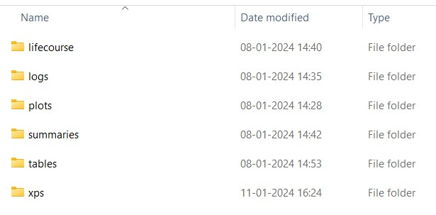

In this vignette, we will run three example scenarios to demonstrate the sorts of alternative scenarios that can be run in IMPACTncdEngl:

- Reducing BMI by 10% in all simulants compared to their BMI in the baseline scenario

- Increasing daily fruit & vegetable consumption by 10% compared to consumption in the baseline scenario

- Increasing the days of physical activity from 0 to 1 per week for 10% of simulants who are inactive in the baseline scenario

#### List for primary prevention variables 


- **active_days_curr_xps** : Number of days of physical activity per week      
- **fruit_curr_xps** : Fruit consumption in grams per day (80g = 1 portion) 
- **veg_curr_xps** : Vegetable consumption in grams per day (80g = 1 portion)      
- **smok_status_curr_xps** : this is current smoking status; 1 = never smoker, 2 = occasional smoker, 3 = ex-smoker, 4 = current smoker
- **smok_cig_curr_xps** : Cigarettes per day     
- **ets_curr_xps** : exposure to second-hand tobacco smoke. At individual level, 0 = not exposed, 1 = exposed
- **alcohol_curr_xps** : alcohol consumption in g/day     
- **bmi_curr_xps** : Body mass index in kg/m\^2 (BMI)       
- **sbp_curr_xps** : Systolic Blood Pressure in mmHg (SBP)         
- **tchol_curr_xps** : Total Cholesterol in mmol/L  

#### List for secondary prevention variables 

- **ra** : Rheumatoid arthritis 
- **helo** : Hearing loss 
- **alcpr** : Alcohol problems 
- **ctd** : Connective tissue disorders (excluding rheumatoid arthritis) 
- **dm** : Diabetes mellitus (both major types) 
- **t1dm** : Type 1 Diabetes Mellitus 
- **t2dm** : Type 2 Diabetes Mellitus 
- **ctdra** : Connective tissue disorders (including rheumatoid arthritis). This is used for the CMS score 
- **af** : Atrial fibrillation 
- **hf** : Heart failure 
- **andep** : Anxiety & depression
- **ckd** : Chronic Kidney disease (CKD)
- **Colorectal_ca / colorect_ca** : colorectal cancer 
- **prostate_ca** : prostate cancer 
- **Breast_ca** : breast cancer
- **Lung_ca** : Lung cancer
- **Other_ca** : other cancers
- **Cancer** : any of the above cancers combined 
- **ibs** : Irritable bowel syndrome
- **htn** : hypertension 
- **copd** : Chronic Obstructive Pulmonary Disease (COPD) 
- **Chd** : Coronary Heart disease    
- **pain** : chronic pain


For our alternative scenarios, we will set the first year the change starts to 2023. We run the baseline scenario before the alternative scenarios so that we can compare results. The results from each additional scenario get appended to the baseline scenario.

1. Set up the simulation parameters following steps 1-4 using the How to run a test of IMPACTncdEngl vignette, which can be accessed using 

```{r}
vignette("how_to_test_run", package = "IMPACTncdEngl")
```

In particular, you may need to adjust the `n` and `n_synthpop_aggregation` parameters to create the desired synthetic population size. If you use the same `synthpop_dir` location as in your test run, the new synthpop files will have a different filename and will not overwrite the existing files. However, you may want to delete the existing synthpop files in the folder to save disk space.

2.  To run a baseline scenario, run the following chunk of code, which deletes everything inside the existing output and log folders, runs a new baseline scenario from scratch and summarises the results of the simulation. 

```{r, run-simulation, eval = FALSE}
IMPACTncd$
  del_logs()$
  del_outputs()$
  run(mc = 1:2, multicore = FALSE, scenario_nam = "sc0")$
  export_summaries(multicore = FALSE)
```

In the above, we use the chain syntax using $, which is equivalent to: 

```{r, run-simulation-break, eval = FALSE}
IMPACTncd$del_logs()
IMPACTncd$del_outputs()
IMPACTncd$run(mc = 1:2, multicore = FALSE, scenario_nam = "sc0")
IMPACTncd$export_summaries(multicore = FALSE)
```

Note: In the arguments for the `run()`, we have selected the number of Monte Carlo iterations to be 2  (mc = 1:2). This is OK for a test run, but in reality, you would like to run at least 100 iterations (i.e. mc = 1:100) in production. If, at a later point, you would like to run 100 more iterations additionally, then you could do `IMPACTncd$run(mc = 101:200, multicore = FALSE, scenario_nam = "sc0")` without deleting the existing output (i.e. do not run `IMPACTncd$del_outputs()`). 

We have also selected `multicore = FALSE` here so that parallel processing is not used. This slows down the simulation, but it requires substantially less computational resources. In production, you would most likely want to set this to TRUE. The third argument of the `run()` function defines the name of the baseline scenario as "sc0" here. Please do not change the name of the baseline scenario.

Finally, the `export_summaries()` generates summary output files from the lifecourse files that are the raw simulation output.

4. After running the code, we will create the folders shown below. The `lifecourse` folder has the same number of files as the number of iterations runs. 

```{r, echo = FALSE, out.width = "50%", fig.cap = "output/hf_real folder structure"}

```

5. After running the baseline scenario, we can run alternative scenarios by updating some of the parameters in `primary_prevention_scn`. 

In this example, we will simulate a scenario in which the BMI of all simulants is 10% lower than in the baseline scenario, we will start this change in the year 2023, and we will run two iterations (the same as in the baseline scenario above). In this `n_runs` as the number of iterations. 

```{r, n-run, eval = FALSE}
n_runs <- 2
```

6. After defining the parameters we need to update `primary_prevention_scn` before running each alternative scenario. We will start by reducing BMI by 10% for all simulants, for every year from 2023 onwards. In this `change_10pc` is the % of change we want to implement in all the scenarios, `sc_year` as the year from which the change should be implemented.

```{r, scn1, eval = FALSE}
IMPACTncd$update_primary_prevention_scn(
  function(sp) {
    change_10pc <- 0.1
    sc_year <- 23L
    sp$pop[year >= sc_year,
           bmi_curr_xps := bmi_curr_xps * (1 -change_10pc)]
    }
  )
```

7. Once the `primary_prevention_scn` is updated we need to run the simulation again as shown below, in this we use the simulation name as `sc1` to represent the scenario we defined above. 

Again, as we will run more scenarios, we don’t need to export the summaries. 

The results from running this scenario will be appended to the baseline scenario results in the lifecourse folder. 

```{r, run-scn1, eval = FALSE}
IMPACTncd$
  run(1:n_runs, multicore = FALSE, "sc1")
```

8. All subsequent alternative scenarios work in the same way. For example, we can improve fruit and vegetable consumption by 10% by updating `primary_prevention_scn` in the years greater than or equal to sc_year.

As we have updated `primary_prevention_scn`, BMI remains at the level in baseline scenario.

```{r, sc2, eval = FALSE}
IMPACTncd$update_primary_prevention_scn(
  function(sp) {
    change_10pc <- 0.1
    sc_year <- 23L
    sp$pop[year >= sc_year, fruit_curr_xps := as.integer(round(fruit_curr_xps * (1 + change_10pc)))]
    sp$pop[year >= sc_year, veg_curr_xps := as.integer(round(veg_curr_xps * (1 + change_10pc)))]
    }
  )
```

9. We then run the simulation again, in this we use the simulation name as `sc2` to represent the scenario we defined above

```{r, run-scn2, eval = FALSE}
IMPACTncd$
  run(1:n_runs, multicore = FALSE, "sc2")
```

10. For physical activity, we will demonstrate a different approach. We will focus only on those people who are inactive in the baseline scenario (0 days of physical activity per week), and for 10% of those people we will increase their level of physical activity to 1 day per week.

Again, we update `primary_prevention_scn`. We start by selecting the patient ids (`pid`) from the population who do no physical activity (`active_days_curr_xps` = 0) in the years greater than or equal to sc_year, and save this as tt. Then we use rbinom to randomly select 10% of these people for whom we will increase physical activity (`active_days_curr_xps`) to 1. We also need to update the `met_curr_xps` (MET ( metabolic equivalent) minutes (in hundreds) per week) variable to reflect the new level of physical activity. We do this using a set formula. 


```{r, sc3, eval = FALSE}
IMPACTncd$update_primary_prevention_scn(
  function(sp) {
    change_10pc <- 0.1
    sc_year <- 23L
    tt <- sp$pop[year >= sc_year & active_days_curr_xps == 0, .(unique(pid))]
    tt <- tt[as.logical(rbinom(.N, 1, abs(change_10pc))), V1]
    sp$pop[pid %in% tt & year >= sc_year, `:=` (
      active_days_curr_xps = 1,
      met_curr_xps = as.integer(floor(1 * (3L + qbinom(runif(.N), 8, 3/11)) *
                                        (30 + qexp(runif(.N), 1/7)) / 100))
    )]
  }
)
```

11. We need to run the simulation again, in this we use the simulation name as `sc3` to represent the scenario we defined above

```{r, run-sc3, eval = FALSE}
IMPACTncd$
  run(1:n_runs, multicore = FALSE, "sc3")
```

12. We need to update `primary_prevention_scn` again to add multiple scenarios in one as shown below which changes BMI, Fruit and Vegetable intake, and Physical Activity for years greater than or equal to `sc_year`; with change percentage defined by `change_10pc.`

```{r, sc4, eval = FALSE}
IMPACTncd$update_primary_prevention_scn(
  function(sp) {
    change_10pc <- 0.1
    sc_year <- 23L
    sp$pop[year >= sc_year, bmi_curr_xps := bmi_curr_xps * (1 - change_10pc)]

    # Fr & vg
    sp$pop[year >= sc_year, fruit_curr_xps := as.integer(round(fruit_curr_xps * (1 + change_10pc)))]
    sp$pop[year >= sc_year, veg_curr_xps := as.integer(round(veg_curr_xps * (1 + change_10pc)))]

    # Physical activity
    tt <- sp$pop[year >= sc_year & active_days_curr_xps == 0, .(unique(pid))]
    tt <- tt[as.logical(rbinom(.N, 1, abs(change_10pc))), V1]
    sp$pop[pid %in% tt & year >= sc_year, `:=` (
      active_days_curr_xps = 1,
      met_curr_xps = as.integer(floor(1 * (3L + qbinom(runif(.N), 8, 3/11)) *
                                        (30 + qexp(runif(.N), 1/7)) / 100))
    )]
  }
)
```

13. We need to run the simulation again, in this we use the simulation name as `sc4` to represent the scenario we defined above. 

As this is our final scenario, we will use `export_summaries` to export summary files into the summaries folder in our output directory. 


In this example, we specify the `type` to only export a few of the summary outputs to reduce computation time. We have chosen: 

- **dis_char** : disease characteristics, e.g. age of onset of condition, mean duration of condition; 

- **prvl** : prevalence of each condition; 

- **incd** : incidence of each condition; 

- **dis_mrtl** : disease-specific mortality; 

- **mrtl** : all-cause mortality; 

- **allcause_mrtl_by_dis** : all-cause mortality by disease;

- **cms** : information on CMS (Cambridge Multimorbidity Score) score and count. 

If type is not specified, all summary files are exported. 

```{r, run-sc4, eval = FALSE}
IMPACTncd$
  run(1:n_runs, multicore = FALSE, "sc4") $
    export_summaries(multicore = FALSE, type = c("dis_char", "prvl",
                     "incd", "dis_mrtl", "mrtl",
                     "allcause_mrtl_by_dis", "cms"))
```

### Other files 

- Use the following code to open the vignette to run a test of IMPACTncdEngl

```{r}
vignette("how_to_test_run", package = "IMPACTncdEngl")
```

- Use the following code to open the vignette to understand model outputs 

```{r}
vignette("understanding_model_outputs", package = "IMPACTncdEngl")
```

- To completely delete the package IMPACTncdEngl is explained in a section called **How to remove IMPACTncdEngl installed package** in the vignette mentioned below

```{r}
vignette("how_to_test_run", package = "IMPACTncdEngl")
```

