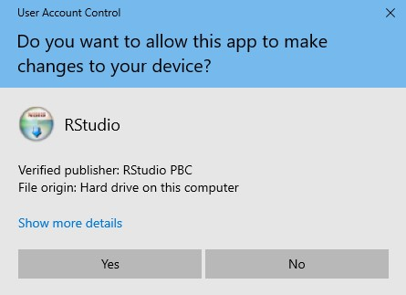
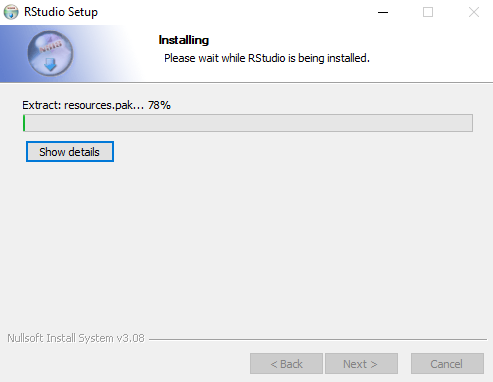

- Installation of RStudio is not mandatory and can be skipped.

- The installation procedure outlined here pertains to version RStudio 2023.12.1.402.

- The installation process for RStudio has exhibited notable consistency throughout the years.

- It is important to note that RStudio should be installed only after installing R which is described [here](path). 

### Steps to install RStudio on Windows

1. Navigate to [RStudio](https://posit.co/download/rstudio-desktop/) and click on **DOWNLOAD RSTUDIO DESKTOP FOR WINDOWS**, once installed, double click on the .exe file downloaded, Click **Yes**

```{r, echo = FALSE, out.width = "50%", fig.cap = ""}

```

2. Click **Next** here to start installation of RStudio (accept defaults)

```{r, echo = FALSE, out.width = "50%", fig.cap = ""}
knitr::include_graphics("img/RStudio_2.jpeg")
```

3. Select a location to store RStudio and its files, or use the defaults, Click **Next**

```{r, echo = FALSE, out.width = "50%", fig.cap = ""}

```

4. Click **Install**

```{r, echo = FALSE, out.width = "50%", fig.cap = ""}
knitr::include_graphics("img/RStudio_4.jpeg")
```
5. Wait for the installation process

```{r, echo = FALSE, out.width = "50%", fig.cap = ""}

```

6. Click **Finish**

```{r, echo = FALSE, out.width = "50%", fig.cap = ""}
knitr::include_graphics("img/RStudio_6.jpeg")
```

7. To check the correct installation of R and RStudio, go to start menu and type RStudio

```{r, echo = FALSE, out.width = "50%", fig.cap = ""}

```

8. If you see the next window check the one you installed and Click **OK**

```{r, echo = FALSE, out.width = "50%", fig.cap = ""}
knitr::include_graphics("img/RStudio_8.jpeg")
```

9. Once RStudio is open you will see this window

```{r, echo = FALSE, out.width = "100%", fig.cap = ""}
knitr::include_graphics("img/RStudio_9.jpeg")
```

10. Now check `2+3` in the RStudio console to check if R is installed properly and should be compiling correctly s
