- The installation procedure outlined here pertains to versions R 4.3.2. 

- The installation process for R has exhibited notable consistency throughout the years.

### Steps to install R on Windows

1. We need to first install R navigate to [CRAN](https://cran.rstudio.com/)
2. Installing R first click **Download R for Windows** 

```{r, echo = FALSE, out.width = "100%", fig.cap = ""}
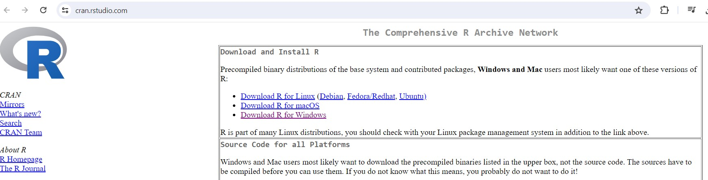
```

3. Once you click it click on **install R for the first time**

```{r, echo = FALSE, out.width = "100%", fig.cap = ""}
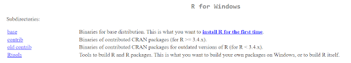
```

4. Now click on **Download R-4.3.2 for Windows**

```{r, echo = FALSE, out.width = "100%", fig.cap = ""}
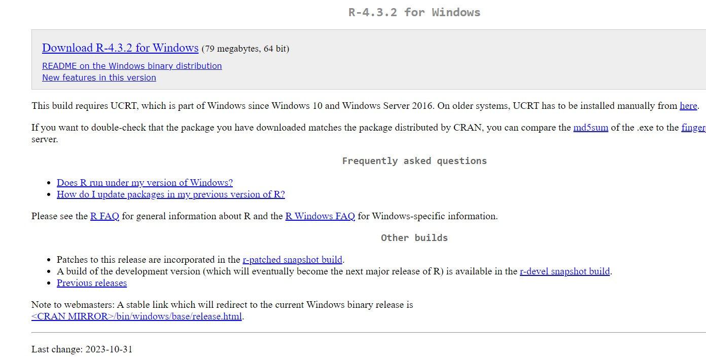
```

5. Double click on the downloaded .exe file which is the setup file, Click **Yes** (accept defaults)

```{r, echo = FALSE, out.width = "50%", fig.cap = ""}
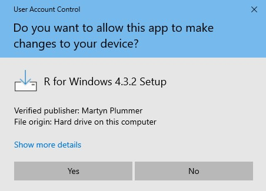
```

6. Select the language needed, here we have chosen here **English**, the default one

```{r, echo = FALSE, out.width = "50%", fig.cap = ""}
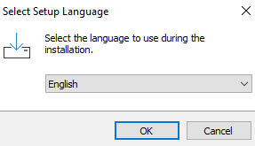
```


7. Select all default features, Click **Next** 

```{r, echo = FALSE, out.width = "50%", fig.cap = ""}
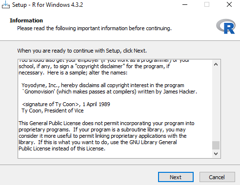
```

8. Click **Next** again to install using default settings and default location, you can also browse to another folder if required

```{r, echo = FALSE, out.width = "50%", fig.cap = ""}
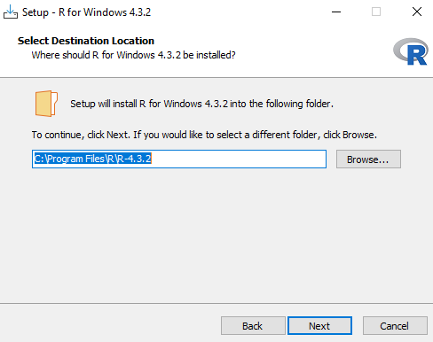
```

9. Then click **Next**  to install the following components

```{r, echo = FALSE, out.width = "50%", fig.cap = ""}
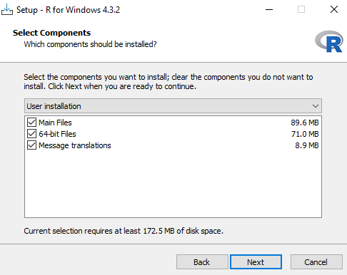
```

10. Check **No**  for default start up options and click **Next** 

```{r, echo = FALSE, out.width = "50%", fig.cap = ""}
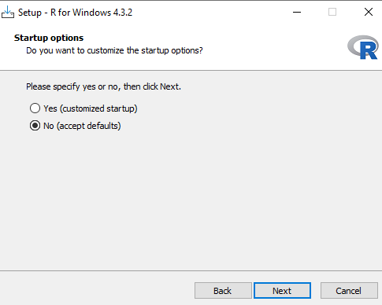
```

11. Click **Next** to select the start Menu folder (accept default)

```{r, echo = FALSE, out.width = "50%", fig.cap = ""}
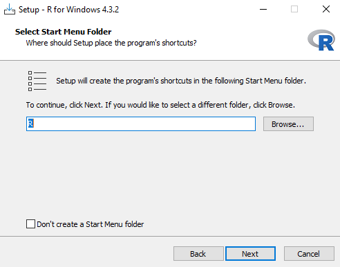
```

12. Check on whichever options you need and click on **Next**

```{r, echo = FALSE, out.width = "50%", fig.cap = ""}
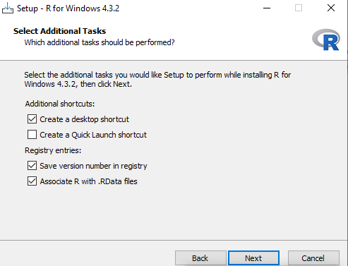
```

13. Wait for the installation process

```{r, echo = FALSE, out.width = "50%", fig.cap = ""}
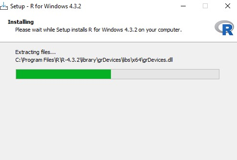
```

14. Once completed this following window will show up, Click **Next** Now we need to add paths of R in the system variables

15. Type Environment variables in search bar of your Windows system, click on **Edit Environment Variables**

```{r, echo = FALSE, out.width = "50%", fig.cap = ""}
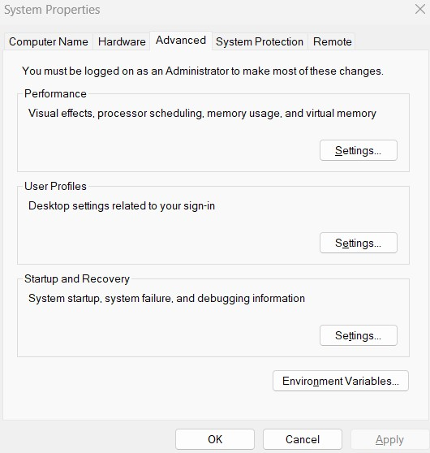
```

16. Click on New  and then add the variable name PATH and the value as *C:\Program Files\R-4.3.2\bin* which is the path where Rscript.exe is stored e.g : *R4.3.2->bin->Rscript.exe*, click **Apply**

```{r, echo = FALSE, out.width = "50%", fig.cap = ""}
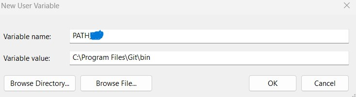
```

19. To check Rscript works on command prompt or console, go to the search bar in Windows, type **cmd** and then click on command prompt / terminal. Once it opens, type `Rscript` in terminal and you should be able to see this

```{r, echo = FALSE, out.width = "50%", fig.cap = ""}
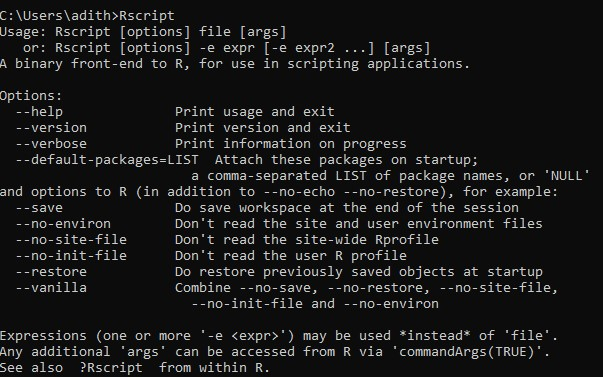
```
