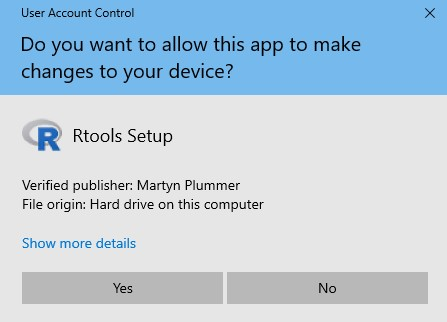

- The installation procedure outlined here pertains to versions RTools 4.3. 

### Steps to install RTools on Windows


1. Navigate to [RTools](https://cran.r-project.org/bin/windows/Rtools/), click on **RTools4.3** and once downloaded, double click on the .exe file

```{r, echo = FALSE, out.width = "100%", fig.cap = ""}
knitr::include_graphics("img/Rtools_1.jpeg")
```

2. [Read Me](https://cran.r-project.org/bin/windows/Rtools/rtools43/rtools.html) (Please read this carefully <5 minutes read)

3. Click **Yes** (accept defaults)

```{r, echo = FALSE, out.width = "50%", fig.cap = ""}

```

4. Select a location to store Rtools and its files, or use the defaults, Click **Next** 

```{r, echo = FALSE, out.width = "50%", fig.cap = ""}
knitr::include_graphics("img/Rtools_3.jpeg")
```

5. Click **Next** 

```{r, echo = FALSE, out.width = "50%", fig.cap = ""}
knitr::include_graphics("img/Rtools_4.jpeg")
```

6. Click **Install** 

```{r, echo = FALSE, out.width = "50%", fig.cap = ""}
knitr::include_graphics("img/Rtools_5.jpeg")
```

7. Wait for the installation process

```{r, echo = FALSE, out.width = "50%", fig.cap = ""}
knitr::include_graphics("img/Rtools_6.jpeg")
```

8. Click **Finish** 

```{r, echo = FALSE, out.width = "50%", fig.cap = ""}
knitr::include_graphics("img/Rtools_7.jpeg")
```

9. To check correct installation of Rtools, install the package devtools using the command in RStudio console and to load the library installed use `find_rtools()` if it says TRUE then Rtools has been installed correctly

```{r, check-rtools, eval = FALSE}
install.packages("devtools")
library(devtools)
find_rtools()
# TRUE
```

```{r, echo = FALSE, out.width = "100%", fig.cap = ""}
knitr::include_graphics("img/Rtools_8.jpeg")
```
