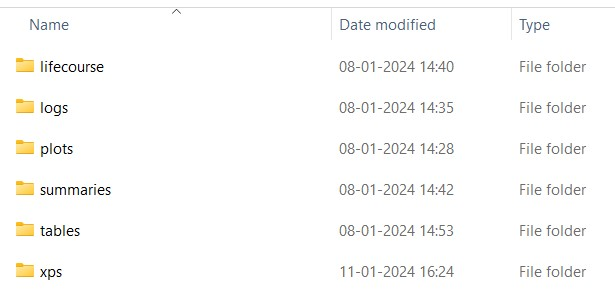
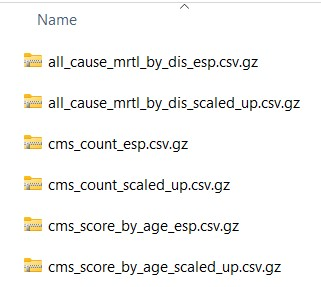
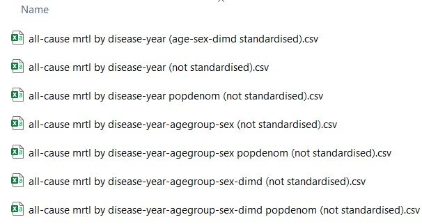

#### Output structure

-   The location of the output folder is determined in the `inputs/sim_design.yaml` file, : `output_dir`, E.g : `/output/hf_real` here.

-   It is advisable not to manually change any files in the **lifecourse**, **xps**, or **summaries** folders.

-   The folders shown below are all the folders generated if we run the baseline scenario as mentioned in [IMPACTncd_Engl - test run](https://docs.google.com/document/d/1rJYNErUTgamlyGw94i-RzgzMSVlzyqxW_CJsZBBN34U/edit). If you specified `logs: no` in the *inputs/sim_design.yaml* file, then the logs folder will not be present.


```{r, echo = FALSE, out.width = "50%", fig.cap = "output/hf_real folder structure"}

```

-   The main folders to check initially after running a simulation are **tables**; **summaries**; **lifecourse**; and **xps**

-   Usually **logs** folder is used for debugging as it logs baseline and other scenarios

-   Usually plots remain empty unless we generate plots

-   So here we will be looking at the remaining folders : **lifecourse**; **tables**; **summaries**; **xps**

-   Some important abbreviations used in each of the files generated in the results are shown below

#### File name abbreviations

-   "**dis_char**" : disease characteristics, e.g. age of onset of the condition, mean duration of the condition
-   "**prvl**" : prevalence of each condition
-   "**incd**" : incidence of each condition
-   "**dis_mrtl**" : disease-specific mortality
-   "**mrtl**" : all-cause mortality
-   "**all_cause_mrtl_by_dis**" : all-cause mortality by disease
-   "**cms**" : information on the Cambridge Multimorbidity Score (CMS) (Cambridge Multimorbidity Score) score and count
-   "**le**" : life expectancy; "**le60**" : life expectancy at 60
-   "**hle**" : healthy life expectancy
-   The two different types are for different thresholds for the ‘end’ of healthy years:
    -   "**1st_cond**" : any 1 condition
    -   "**cmsmm1.5**" : CMS score of \> 1.5

#### Important Note

-   **esp** : standardised to the 2013 European Standardised Population; uses "**wt_esp**"
-   **scaled_up** : scaled up to the ONS population projection estimates; uses "**wt**"
-   **sha** : Geographic Region (comes from Strategic Health Authority)

#### Disease abbreviations

-   "**cms1st_cont**" : Only one CMS condition
-   "**cmsmm0**" : CMS \> 0
-   "**cmsmm1**" : CMS \> 1
-   "**cmsmm1.5**" : CMS \> 1.5
-   "**cmsmm2**" : CMS \> 2
-   "**ra**" : Rheumatoid arthritis
-   "**helo**" : Hearing loss
-   "**alcpr**" : Alcohol problems
-   "**ctd**" : Connective tissue disorders (excluding rheumatoid arthritis)
-   "**dm**" : Diabetes mellitus (both major types)
-   "**t1dm**" : Type 1 Diabetes Mellitus
-   "**t2dm**" : Type 2 Diabetes Mellitus
-   "**ctdra**" : Connective tissue disorders (including rheumatoid arthritis). This is used for the CMS score
-   "**af**" : Atrial fibrillation
-   "**hf**" : Heart failure
-   "**andep**" : Anxiety & depression
-   "**ckd**" : Chronic Kidney disease (CKD)
-   "**Colorectal_ca / colorect_ca**" : colorectal cancer
-   "**prostate_ca**" : prostate cancer
-   "**Breast_ca**" : breast cancer
-   "**Lung_ca**" : Lung cancer
-   "**Other_ca**" : other cancers
-   "**Cancer**" : any of the above cancers combined
-   "**ibs**" : Irritable bowel syndrome
-   "**htn**" : hypertension
-   "**copd**" : Chronic Obstructive Pulmonary Disease (COPD)
-   "**Chd**" : Coronary Heart disease
-   "**pain**" : chronic pain

### lifecourse Folder

The files inside lifecourse folder are as shown below; the number of files generated will be dependent on the number of iterations run for baseline and various scenarios, here it is two; because of the uncertainty in the model, the results will vary between lifecourse files. These files contain the 'lifecourse' for each simulant in the model. Each row represents 1 simulant for each year they are 'alive' in the model, and contains information on their socio demographic and disease information. These files are the direct output of the model and are used to create the 'summaries' files.


```{r, echo = FALSE, out.width = "50%", fig.cap = "lifecourse folder structure"}

```

#### Column names

-   **pid** : unique person ID
-   **year** : year
-   **age** : age
-   **agegrp** : age group
-   **sex** : sex
-   **dimd** : the decile group of the index of multiple deprivation
-   **ethnicity** : ethnicity
-   **sha** : Geographic region (from Strategic Health Authority)
-   **pid_mark** : TRUE/FALSE marker for whether this is the first year the simulant enters the model
-   **scenario** : scenario identification
-   **mc** : Monte Carlo iteration
-   **cms_score**; **cms_count** : CMS score; CMS count
-   **cms1st_cont_prvl** : Only one CMS condition
-   **cmsmm0_prvl**; **cmsmm1_prvl**; **cmsmm1.5_prvl**; **cmsmm2_prvl** : CMS \> 0; CMS \> 1; CMS \> 1.5; CMS \> 2
-   **X_prvl** : number of years with the condition. If this is 1, this is what is used for the incd summary files & age_onset. If this is \> 0 it counts as a prevalent case
-   **X_dgns** : number of years since diagnosis with the condition. Currently, this is identical to X_prvl. In future versions of the model, we may explicitly model diagnosed and undiagnosed components of disease incidence and prevalence.
-   **wt_esp** : standardised to the 2013 European Standardised Population
-   **wt** : scaled up to the ONS population projection estimates
-   **all_cause_mrtl** : if \> 0 died in that year. The integer is a code for cause of death - you can find the code lookups for all-cause mortality in the `sim_design.yaml` file under. For each condition with an associated cause of death will have a code under the mortality section. Not all conditions will have a cause listed as not all conditionals are lethal in the model. 
E.g.: For type 2 diabetes it is 4.

|Disease           | mortality code|
|:-----------------|----:|
|nonmodelled          | 1|
|CHD    | 2|
|Stroke        | 3|
|T2DM    | 4|
|AF | 5|
|hypertension         | 6|
|COPD           | 7|
|dementia         | 8|
|asthma    | 9|
|ckd stage 3-5 | 10|
|lung cancer           | 11|
|colorectal cancer         | 12|
|prostate cancer    | 13|
|breast cancer        | 14|
|anxiety & depression    | 15|
|other cancers | 16|
|heart failure           | 17|
|connective tissue disorders         | 19|
|epilepsy    | 20|
|alcohol problems        | 21|
|psychosis    | 22|
|rheumatoid arthritis | 23|
|non-type-2 diabetes mellitus           | 24|
|constipation        | 25|
|chronic pain    | 26|


### summaries Folder

The files inside the summaries folder contain


```{r, echo = FALSE, out.width = "50%", fig.cap = "summaries folder structure"}

```

#### Column names

[Disease characteristics file]{.underline} : this gives information about the people who have X condition in Y year.

-   **scenario** : scenario
-   **mc** : Monte Carlo iteration
-   **year** : Year
-   **agegrp** : Age group
-   **dimd** : Decile group of the English Index of Multiple Deprivation
-   **cases** : total number of cases (people with the condition)
-   **all_cause_mrtl_by_dis** : all cause mortality by disease
-   **cms_score** : Cambridge Multimorbidity Score (CMS)
-   **mean_cms_score** : mean Cambridge Multimorbidity Score (CMS)
-   **cms_count** : number of conditions within the CMS
-   **mean_cms_count** : mean number of conditions within the CMS
-   **dis_characteristics** : disease characteristics; e.g. age of onset of condition, mean duration of condition
-   **dis_mrtl** : disease-specific mortality
-   **hle_1st_cond**, **hle_cmsmm1.5** : healthy life expectancy; the two different types are for different thresholds for the ‘end’ of healthy years: **1st_cond** - any 1 condition; **cmsmm1.5** = CMS score of \>1.5 incd : incidence of each condition
-   **le** : life expectancy. Note that this is not from birth but from the age the synthetic individuals enter the model that is defined in the `inputs/sim_design.yaml` file. The default is, therefore, life expectancy at 30.
-   **le60** : life expectancy at 60
-   **mrtl** : mortality
-   **mean_age_incd** : mean age of condition incidence
-   **mean_age_1st_onset** : mean age of the first incidence of a condition - some conditions can go into recovery/remission and then re-occur (e.g. asthma, anxiety & depression, etc.). This variable takes the mean age at the first onset
-   **mean_age_prvl** : mean age of everyone with the condition (new and existing cases)
-   **mean_duration** : mean duration that people have had the condition
-   **X_prvl** : the number of people with the condition (new and pre-existing cases) where X is disease
-   **popsize** : total number of people in the strata
-   **esp** : standardised to the 2013 European Standardised Population
-   **scaled_up** : scaled up to the ONS population projection estimates

[Prevalence file (prvl)]{.underline}\
- **X_prvl** : the number of people with the condition (new and pre-existing cases) where X is a disease \
- **popsize** : total number of people in the strata

[Incidence file (incd)]{.underline}\
- **X_incd** : the number of people with new cases of the condition \
- **popsize** : total number of people in the strata (not just those at risk)

### tables Folder

The files inside the tables folder contain statistical summaries of different parameters based on different groups. The median (\_50.0%) from all iterations is presented alongside two levels of uncertainty: 95% (lower uncertainty interval (LUI): \_2.5%, upper uncertainty interval (UUI): \_97.5%) and 80% (LUI: \_10.0%, UUI: \_90/0%).

The parameters used here are -

**parameter (shortform) {specification of the parameter}**

-   all-cause mrtl (all_cause_mrtl_by_disease_rate){disease}
-   disease characteristics (value) {disease; type}
-   exposure (xps) {exposure}
-   fatality (ftlt) {disease}
-   incidence (incd) {disease}
-   mean CMS count (mean-cms_count) {}
-   mean CMS score (mean_cms_score) {}
-   mortality (mrtl) {disease}
-   pop size (pop_size) {}
-   prevalence (prvl) {disease}

Various standardisations used are `not standardised` (scaled up to the ONS population projections); `age standardised`; `age-dimd standardised`; `age-sex standardised`; `age-sex-dimd standardised`. 
Standardisation is done using the 2013 European Standardised Population (ESP). For standardisation beyond age standardisation, we assume that the population is equally sized between the respective groups and that the age distribution in each follows the 2013 ESP.

The file name is as follows : 

**parameter by multiple-groups (standarisation_if_applied).csv** 

- all-cause mrtl by disease-year (age-sex-dimd standardised).csv 
- disease characteristics by year (not standardised).csv

```{r, echo = FALSE, out.width = "50%", fig.cap = "tables folder structure"}

```


#### Column names 

- **scenario** : scenario name 
- **groups (year; agegrp; sex; disease)**
- **specification of parameter** : disease; type; exposure 
- **parameter_percentile** : all-cause mrtl; disease characteristics; exposure; fatality; incidence; mean CMS count; mean CMS score; mortality; pop size; prevalence at the specified level of uncertainty: 2.5 %, 10 %, 50 %, 90 %, 97.5 %

### xps Folder 

```{r, echo = FALSE, out.width = "50%", fig.cap = "xps folder structure"}

```

mean risk factor exposure levels 

- **Xps20.csv.gz** : unstandardised. With age in 20-year age groups 
- **Xps_esp.csv.gz** : standardised to ESP 


#### Column names 

- **year** : year 
- **sex** : sex 
- **qimd** : 
- **scenario** : scenario 
- **mc** : Monte Carlo iteration 
- **agegrp20** : age group 
- **active_days_curr_xps** : Number of days of physical activity per week 
- **fruit_curr_xps** : Fruit consumption in grams per day (80g = 1 portion) 
- **veg_curr_xps** : Vegetable consumption in grams per day (80g = 1 portion) 
- **smok_quit_yrs_curr_xps** : For ex-smokers, years since quit smoking 
- **smok_dur_curr_xps** : Number of years been a smoker 
- **smok_cig_curr_xps** : Cigarettes per day 
- **ets_curr_xps** : exposure to second-hand tobacco smoke. At individual level, 0 = not exposed, 1 : exposed\
- **alcohol_curr_xps** : alcohol consumption in g/day
- **bmi_curr_xps** : Body mass index in kg/m\^2 (BMI)
- **sbp_curr_xps** : Systolic Blood Pressure in mmHg (SBP)
- **tchol_curr_xps** : Total Cholesterol in mmol/L
- **statin_px_curr_xps** : Prescribed statins. At individual level, 0 = no, 1 = yes
- **smok_packyrs_curr_xps** : Smoking pack-years - this is the total amount smoked so far, taking into account the number of cigarettes smoked per day and the length of time smoked
- **smok_never_curr_xps** : never smoked. At the individual level, 0 = has smoked, 1 = never smoked
- **smok_active_curr_xps** : current smoker. At individual level, 0 = doesn’t smoke, 1 = currently smokes
