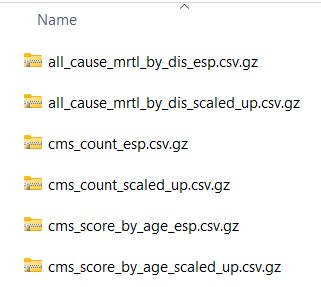
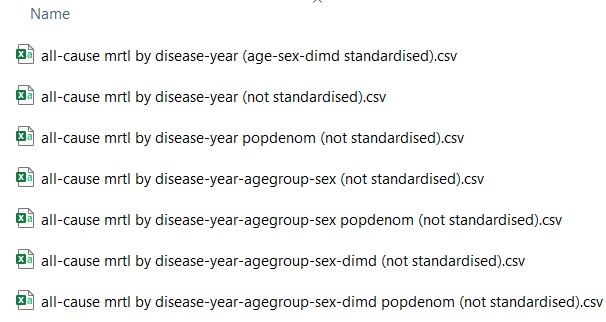

#### Output structure

-   The location of the output folder is determined in the `inputs/sim_design.yaml` file, : `output_dir`, E.g : `/output/hf_real` here.

-   It is advisable not to manually change any files in the **lifecourse**, **xps**, or **summaries** folders.

-   The folders shown below are all the folders generated if we run the baseline scenario as mentioned in [IMPACTncd_Engl - test run](https://docs.google.com/document/d/1rJYNErUTgamlyGw94i-RzgzMSVlzyqxW_CJsZBBN34U/edit). If you specified `logs: no` in the *inputs/sim_design.yaml* file, then the logs folder will not be present.


```{r, echo = FALSE, out.width = "50%", fig.cap = "output/hf_real folder structure"}

```

-   The main folders to check initially after running a simulation are **tables**; **summaries**; **lifecourse**; and **xps**

-   Usually **logs** folder is used for debugging as it logs baseline and other scenarios -- see [logs Folder] for what each file in it contains

-   Usually plots remain empty unless we generate plots

-   So here we will be looking at the remaining folders : **lifecourse**; **tables**; **summaries**; **xps**

-   Some important abbreviations used in each of the files generated in the results are shown below

#### File name abbreviations

-   "**dis_char**" : disease characteristics, e.g. age of onset of the condition, mean duration of the condition
-   "**prvl**" : prevalence of each condition
-   "**incd**" : incidence of each condition
-   "**dis_mrtl**" : disease-specific mortality
-   "**mrtl**" : all-cause mortality
-   "**all_cause_mrtl_by_dis**" : all-cause mortality by disease
-   "**cms**" : information on the Cambridge Multimorbidity Score (CMS) (Cambridge Multimorbidity Score) score and count
-   "**le**" : life expectancy; "**le60**" : life expectancy at 60
-   "**hle**" : healthy life expectancy
-   "**qalys**" : Quality-Adjusted Life Years
-   "**costs**" : costs from a societal perspective, including healthcare costs, formal social care costs, informal care costs, and economic output (productivity from paid and unpaid work)
-   The two different types are for different thresholds for the ‘end’ of healthy years:
    -   "**1st_cond**" : any 1 condition
    -   "**cmsmm1.5**" : CMS score of \> 1.5

#### Important Note

-   **esp** : standardised to the 2013 European Standardised Population; uses "**wt_esp**"
-   **scaled_up** : scaled up to the ONS population projection estimates; uses "**wt**"
-   **sha** : Geographic Region (comes from Strategic Health Authority)

#### Disease abbreviations

-   "**cms1st_cont**" : Only one CMS condition
-   "**cmsmm0**" : CMS \> 0
-   "**cmsmm1**" : CMS \> 1
-   "**cmsmm1.5**" : CMS \> 1.5
-   "**cmsmm2**" : CMS \> 2
-   "**ra**" : Rheumatoid arthritis
-   "**helo**" : Hearing loss
-   "**alcpr**" : Alcohol problems
-   "**ctd**" : Connective tissue disorders (excluding rheumatoid arthritis)
-   "**dm**" : Diabetes mellitus (both major types)
-   "**t1dm**" : Type 1 Diabetes Mellitus
-   "**t2dm**" : Type 2 Diabetes Mellitus
-   "**ctdra**" : Connective tissue disorders (including rheumatoid arthritis). This is used for the CMS score
-   "**af**" : Atrial fibrillation
-   "**hf**" : Heart failure
-   "**andep**" : Anxiety & depression
-   "**ckd**" : Chronic Kidney disease (CKD)
-   "**Colorectal_ca / colorect_ca**" : colorectal cancer
-   "**prostate_ca**" : prostate cancer
-   "**Breast_ca**" : breast cancer
-   "**Lung_ca**" : Lung cancer
-   "**Other_ca**" : other cancers
-   "**Cancer**" : any of the above cancers combined
-   "**ibs**" : Irritable bowel syndrome
-   "**htn**" : hypertension
-   "**copd**" : Chronic Obstructive Pulmonary Disease (COPD)
-   "**Chd**" : Coronary Heart disease
-   "**pain**" : chronic pain

### logs Folder

Present only when `logs: yes` in the design YAML. It holds three kinds of file:

-   **`times.txt`** -- one timestamped line per phase boundary and per Monte
    Carlo iteration (`Start/End mc iteration <n>`, `Start/End of
    parallelisation`, the export phases). This is the file to read first when a
    run took longer than expected: it lets you separate compute time from
    waiting, and recover the realised worker concurrency.

-   **`log<mc>.txt`** -- one file per synthpop iteration, holding that worker's
    own console output. Workers redirect their own output here, which is why a
    problem in the parent process does not show up in them.

-   **`console.txt`** -- everything the *parent* process would otherwise have
    printed to the terminal during `run()`, `export_summaries()` and
    `export_tables()`, including `foreach`'s `.verbose` task bookkeeping.
    Phases append, each behind a `===== <phase> at: <timestamp> =====` banner.

`console.txt` exists for two reasons. The obvious one is that terminal
scrollback is finite and disappears, so without it the record of a run is lost.
The subtler one is that writing a large burst of output *to a terminal* is
dangerous for a long job: if that terminal's output has been stopped -- a stray
`^S` sets this, and it survives detaching a `screen`/`tmux` session -- the
process blocks in `write()` indefinitely, consuming no CPU, producing no error,
and looking exactly like a hung simulation. `foreach(.verbose = TRUE)` emits all
of its per-task bookkeeping in a single burst when the loop returns (~21 KB for
a 200-iteration run), which is precisely the shape of write that triggers this.
A regular file has no terminal line discipline and cannot be stopped this way.

Two caveats. This is an **R-level** redirect: it captures `cat`/`print`/
`message` and Rcpp's `Rcout`, but not writes that a linked C library (arrow,
libgomp, BLAS) makes straight to file descriptors 1/2. And it is released on
exit -- including on error -- so a fatal error is still printed to your
terminal rather than disappearing into the file. For unattended runs, belt and
braces, also redirect at the shell:

``` bash
Rscript scenarios/my_scenario.R > /path/to/output/logs/shell.log 2>&1
```

### lifecourse Folder

The files inside lifecourse folder are as shown below; the number of files generated will be dependent on the number of iterations run for baseline and various scenarios, here it is two; because of the uncertainty in the model, the results will vary between lifecourse files. These files contain the 'lifecourse' for each simulant in the model. Each row represents 1 simulant for each year they are 'alive' in the model, and contains information on their socio demographic and disease information. These files are the direct output of the model and are used to create the 'summaries' files.


```{r, echo = FALSE, out.width = "50%", fig.cap = "lifecourse folder structure"}

```

#### Column names

-   **pid** : unique person ID
-   **year** : year
-   **age** : age
-   **agegrp** : age group
-   **sex** : sex
-   **dimd** : the decile group of the index of multiple deprivation
-   **ethnicity** : ethnicity
-   **sha** : Geographic region (from Strategic Health Authority)
-   **pid_mrk** : TRUE/FALSE marker for whether this is the first year the simulant enters the model
-   **scenario** : scenario identification
-   **mc** : Monte Carlo iteration
-   **income** : income group (used for QALY estimation)
-   **education** : education level (used for QALY estimation)
-   **LAD17CD** : Local Authority District code (2017 boundaries)
-   **cms_score**; **cms_count** : CMS score; CMS count
-   **cms1st_cont_prvl** : Only one CMS condition
-   **cmsmm0_prvl**; **cmsmm1_prvl**; **cmsmm1.5_prvl**; **cmsmm2_prvl** : CMS \> 0; CMS \> 1; CMS \> 1.5; CMS \> 2
-   **cmscs1_prvl** : CMS score strata 1 (CMS score \< 0.09)
-   **cmscs2_prvl** : CMS score strata 2 (0.09 \<= CMS score \< 0.69)
-   **cmscs3_prvl** : CMS score strata 3 (0.69 \<= CMS score \< 1.59)
-   **cmscs4_prvl** : CMS score strata 4 (1.59 \<= CMS score \< 2.96)
-   **cmscs5_prvl** : CMS score strata 5 (CMS score \>= 2.96)
-   **X_prvl** : number of years with the condition. If this is 1, this is what is used for the incd summary files & age_onset. If this is \> 0 it counts as a prevalent case
-   **X_dgns** : number of years since diagnosis with the condition. Currently, this is identical to X_prvl. In future versions of the model, we may explicitly model diagnosed and undiagnosed components of disease incidence and prevalence.
-   **wt_esp** : standardised to the 2013 European Standardised Population
-   **wt** : scaled up to the ONS population projection estimates
-   **all_cause_mrtl** : if \> 0 died in that year. The integer is a code for cause of death - you can find the code lookups for all-cause mortality in the `sim_design.yaml` file under. For each condition with an associated cause of death will have a code under the mortality section. Not all conditions will have a cause listed as not all conditionals are lethal in the model. 
E.g.: For type 2 diabetes it is 4.

|Disease           | mortality code|
|:-----------------|----:|
|nonmodelled          | 1|
|CHD    | 2|
|Stroke        | 3|
|T2DM    | 4|
|AF | 5|
|hypertension         | 6|
|COPD           | 7|
|dementia         | 8|
|asthma    | 9|
|ckd stage 3-5 | 10 (currently disabled)|
|lung cancer           | 11|
|colorectal cancer         | 12|
|prostate cancer    | 13|
|breast cancer        | 14|
|anxiety & depression    | 15|
|other cancers | 16|
|heart failure           | 17|
|connective tissue disorders         | 19|
|epilepsy    | 20|
|alcohol problems        | 21|
|psychosis    | 22|
|rheumatoid arthritis | 23|
|non-type-2 diabetes mellitus           | 24|
|constipation        | 25|
|chronic pain    | 26|


### summaries Folder

The files inside the summaries folder contain


```{r, echo = FALSE, out.width = "50%", fig.cap = "summaries folder structure"}

```

#### Column names

[Disease characteristics file]{.underline} : this gives information about the people who have X condition in Y year.

-   **scenario** : scenario
-   **mc** : Monte Carlo iteration
-   **year** : Year
-   **agegrp** : Age group
-   **dimd** : Decile group of the English Index of Multiple Deprivation
-   **cases** : total number of cases (people with the condition)
-   **all_cause_mrtl_by_dis** : all cause mortality by disease
-   **cms_score** : Cambridge Multimorbidity Score (CMS)
-   **mean_cms_score** : mean Cambridge Multimorbidity Score (CMS)
-   **cms_count** : number of conditions within the CMS
-   **mean_cms_count** : mean number of conditions within the CMS
-   **dis_characteristics** : disease characteristics; e.g. age of onset of condition, mean duration of condition
-   **dis_mrtl** : disease-specific mortality
-   **hle_1st_cond**, **hle_cmsmm1.5** : healthy life expectancy; the two different types are for different thresholds for the ‘end’ of healthy years: **1st_cond** - any 1 condition; **cmsmm1.5** = CMS score of \>1.5 incd : incidence of each condition
-   **le** : life expectancy. Note that this is not from birth but from the age the synthetic individuals enter the model that is defined in the `inputs/sim_design.yaml` file. The default is, therefore, life expectancy at 30.
-   **le60** : life expectancy at 60
-   **mrtl** : mortality
-   **qalys** : Quality-Adjusted Life Years
-   **costs** : healthcare costs
-   **mean_age_incd** : mean age of condition incidence
-   **mean_age_1st_onset** : mean age of the first incidence of a condition - some conditions can go into recovery/remission and then re-occur (e.g. asthma, anxiety & depression, etc.). This variable takes the mean age at the first onset
-   **mean_age_prvl** : mean age of everyone with the condition (new and existing cases)
-   **mean_duration** : mean duration that people have had the condition
-   **X_prvl** : the number of people with the condition (new and pre-existing cases) where X is disease
-   **popsize** : total number of people in the strata
-   **esp** : standardised to the 2013 European Standardised Population
-   **scaled_up** : scaled up to the ONS population projection estimates

[Prevalence file (prvl)]{.underline}\
- **X_prvl** : the number of people with the condition (new and pre-existing cases) where X is a disease \
- **popsize** : total number of people in the strata

[Incidence file (incd)]{.underline}\
- **X_incd** : the number of people with new cases of the condition \
- **popsize** : total number of people in the strata (not just those at risk)

### tables Folder

The files inside the tables folder contain statistical summaries of different parameters based on different groups. The median (\_50.0%) from all iterations is presented alongside two levels of uncertainty: 95% (lower uncertainty interval (LUI): \_2.5%, upper uncertainty interval (UUI): \_97.5%) and 80% (LUI: \_10.0%, UUI: \_90.0%).

```{r, echo = FALSE, out.width = "50%", fig.cap = "tables folder structure"}

```

The tables are generated by the `export_tables()` method, which produces the following groups of tables in parallel:

1. **Main tables** — prevalence, incidence, mortality, case fatality, QALYs, costs, and comparison metrics
2. **All-cause mortality by disease tables** — all-cause mortality rates stratified by disease
3. **Disease characteristics tables** — mean duration, mean age of incidence/prevalence/first onset, mean CMS score and count
4. **Exposure tables** — mean risk factor exposure levels
5. **Cost-effectiveness tables** — cumulative discounted incremental QALYs and costs, ICER and net monetary benefit (when `cea = TRUE`)
6. **Equity slope-index tables** — how the cumulative CPP, CYPP, DPP and net-QALYs benefits are distributed across DIMD deprivation deciles (when `equity = TRUE`)

#### Table types and file naming

The file name follows this pattern:

**parameter by stratification-variables (standardisation).csv**

For example:

- `prevalence by year-agegrp-sex (not standardised).csv`
- `all-cause mortality by year-sex (age-dimd standardised).csv`
- `disease characteristics by year (not standardised).csv`
- `QALYs by year (not standardised).csv`
- `costs by year-sex (age-dimd standardised).csv`

##### Main tables

The following parameters are generated for both non-standardised (scaled up to ONS population projections) and ESP-standardised outputs:

| Parameter | Shortform | Column prefix | Description |
|:----------|:----------|:--------------|:------------|
| Prevalence | prvl | prvl_rate_ | Rate of prevalent cases per population |
| Prevalence relative change | prvl_change_relative | prct_change_relative_ | Relative change in prevalence from baseline year |
| Prevalence absolute change | prvl_change_absolute | abs_change_ | Absolute change in prevalence from baseline year |
| Incidence | incd | incd_rate_ | Rate of incident cases per population |
| Incidence relative change | incd_change_relative | prct_change_relative_ | Relative change in incidence from baseline year |
| Incidence absolute change | incd_change_absolute | abs_change_ | Absolute change in incidence from baseline year |
| Case fatality | ftlt | ftlt_rate_ | Deaths per prevalent cases |
| All-cause mortality | mrtl | mrtl_rate_ | All-cause mortality rate per population |
| Disease-specific mortality | dis_mrtl | disease_mrtl_rate_ | Disease-specific mortality rate per population |
| Pop size | pop | pop_size_ | Total population size (non-standardised only) |
| QALYs | qalys | qalys_ | Quality-Adjusted Life Years (based on EQ-5D-5L). Includes both annual and cumulative values. Optionally discounted |
| Net QALYs | net_qalys | net_qalys_ | Difference in QALYs between intervention and baseline scenarios. Includes both annual and cumulative values |
| Costs | costs | costs_ | Costs from a societal perspective (healthcare, formal social care, informal care, and economic output). Includes both annual and cumulative values. Optionally discounted |
| Net costs | net_costs | net_costs_ | Difference in costs between intervention and baseline scenarios. Includes both annual and cumulative values |
| Cases prevented or postponed | cpp | cpp_ | Difference in incident cases between baseline and intervention (annual and cumulative) |
| Case-years prevented or postponed | cypp | cypp_ | Difference in prevalent cases between baseline and intervention (annual and cumulative) |
| Deaths prevented or postponed | dpp | dpp_ | Difference in deaths between baseline and intervention (annual and cumulative) |

Note: comparison metrics (net QALYs, net costs, cpp, cypp, dpp) are only generated when intervention scenarios are present alongside the baseline scenario.

##### All-cause mortality by disease tables

Three variants are produced:

- **Disease denominator** (`all-cause mortality given disease-...`): all-cause mortality rate among people with each disease (deaths / cases with disease)
- **Population denominator** (`all-cause mortality given disease-... popdenom`): all-cause mortality by disease as a proportion of total population (non-standardised only)
- **ESP-standardised**: age (and optionally sex, dimd) standardised rates with disease denominator

##### Disease characteristics tables

Always non-standardised. Each row contains a disease and a characteristic type:

- **mean_duration** : mean years with the condition
- **mean_age_incd** : mean age at incident cases
- **mean_age_1st_onset** : mean age at first onset (relevant for recurring conditions)
- **mean_age_prvl** : mean age of all prevalent cases
- **mean_cms_score** : mean CMS score among people with the condition
- **mean_cms_count** : mean CMS count among people with the condition

Values are weighted by case counts.

##### Exposure tables

Generated from the xps output files for both non-standardised (xps20, 20-year age groups) and ESP-standardised (xps5, 5-year age groups) exposure data. These tables summarise mean risk factor exposure levels across strata (see xps Folder below for the list of exposures).

##### Equity slope index tables

Produced when `equity = TRUE` (the default). These summarise how each cumulative policy benefit is distributed across the socioeconomic gradient, using absolute and relative analogues of the **Slope Index of Inequality (SII)** and **Relative Index of Inequality (RII)**. Files are named `equity <metric> slope index by <strata> (not standardised).csv`, one per metric (`cpp`, `cypp`, `dpp`, `net_qalys`) and stratum (`year`, `year-sex`).

For each metric, scenario, year (and sex), and disease, the deprivation gradient is fit **across the ten DIMD deciles per Monte-Carlo iteration** and then quantiled across iterations (so the uncertainty comes from the model's own Monte-Carlo draws — no bootstrap). Each decile is assigned a population-weighted midpoint cumulative rank (a *ridit* score) in \([0, 1]\), ordered from least deprived (\(r \to 0\)) to most deprived (\(r \to 1\)), and the **population-weighted OLS slope** of the per-capita cumulative benefit on the ridit score is the SII. A `gradient` column records which deprivation axis was used (see below), and a `type` column gives:

| type | Meaning |
|:-----|:--------|
| `AEI_total` | Absolute equity index — the SII scaled to the whole reference population (\(SII \times n\)) |
| `AEI_per100k` | The SII per 100,000 people alive in the reporting year |
| `total_benefit` | The total undiscounted benefit the gradient was fit to |
| `REI_rel` | Relative equity index — the SII divided by the population-weighted mean benefit; `NA` unless that mean is positive |
| `RII_ratio` | Ratio of the fitted benefit at the most-deprived end to that at the least-deprived end; `NA` unless the fitted benefit is positive at **both** ends |
| `fit_R2` | Population-weighted \(R^2\) of the straight-line fit |

An `n_mc` column records how many Monte-Carlo draws each published quantile actually rests on. It is *not* the number of iterations run: the finite-value filter is applied per `type`, so the relative indices can be summarised over a strict subset of the draws the absolute ones use. A low `n_mc` on `REI_rel` or `RII_ratio` means it has been truncated by the positivity conditions and should not be quoted on its own. It does **not** flag the other failure mode — a near-zero mean benefit gives a full-`n_mc` row with a wildly unstable `REI_rel`.

Reading the four indices:

- `AEI_total` is the **hypothetical** total benefit difference if *every* person in the population received the fitted most-deprived per-capita benefit instead of the fitted least-deprived one. It is **not** the benefit difference between the most- and least-deprived deciles themselves, which is roughly an order of magnitude smaller. Because it scales with \(n\) it is not comparable across localities, strata or years — use `AEI_per100k` or `REI_rel` for that. (`AEI_total / AEI_per100k` is exactly \(n/10^5\).)
- `AEI_per100k`'s regressand is a benefit *cumulated* from `baseline_year`, so it is a stock per head, not a rate per 100,000 person-years. Do not set it beside a published annual-rate SII, which it exceeds by roughly the number of years accumulated.
- `REI_rel` is comparable across metrics on a fixed gradient axis, but is ~3.5% larger on quintiles than on deciles for the same underlying inequality, and is unstable when the mean benefit is near zero.
- `RII_ratio` being `NA` is common rather than exceptional — in a whole-England run the ratio is defined for well under half of the `cpp`/`cypp`/`dpp` rows.
- `total_benefit` is reported because the absolute indices are **translation-invariant**: shifting every group's per-capita benefit by the same amount, in either direction, leaves `AEI_total` and `AEI_per100k` bit-identical. Without it, a policy that flattens the gradient by *harming everyone* is indistinguishable from one that raises the most deprived. It is undiscounted, so do not try to reconcile it with the discounted CEA net QALYs. Unlike `AEI_total` it *is* exactly invariant under the decile → quintile collapse, since sums are additive.

Given \(n\), the indices carry only **two** free numbers: the slope and the mean benefit, with `RII_ratio` \(= (1 + \tfrac{1}{2}\,\)`REI_rel`\()/(1 - \tfrac{1}{2}\,\)`REI_rel`\()\). They are not independent lines of evidence — they stand or fall together on the same linear fit. Each `type` is also quantiled independently, so the published columns of one row do not satisfy those within-draw identities, and the `all_diseases_sum` median is not the sum of the disease medians. (Within a draw the absolute index *is* exactly additive over any partition of the benefit; the median across draws does not preserve that.) This is the standard probabilistic-sensitivity convention — the median ICER is not the ratio of median cost to median QALY. If you need an additive decomposition, work per draw and summarise afterwards.

The percentile columns summarise variation **across Monte-Carlo draws** — parameter uncertainty and synthpop stochasticity. They are Monte-Carlo percentile intervals, not frequentist confidence intervals. There is deliberately no within-draw regression standard error: the decile points scatter about the fitted line partly because of the same simulation draw whose variation the percentiles already summarise, so an analytic SE would double-count; and to the extent the residual is *not* simulation noise it is departure from linearity — structural misspecification, which does not shrink with more draws — so an SE built from it would price misspecification as sampling error. The grouped-data asymptotic variance of Kakwani, Wagstaff & van Doorslaer (1997) is a *survey-sampling* variance and has no referent here, because the deciles are a complete enumeration of the synthetic cohort rather than a sample. Structural uncertainty — the disease model, the effect sizes, and the assumption that the gradient is linear in the ridit — sits outside the interval entirely.

All metrics are "goods", so the **sign convention is pro-poor**: a positive index means the most deprived gain more (inequality-reducing); a negative index is pro-rich (inequality-widening). For `cpp`/`cypp` a `disease` value of `all_diseases_sum` gives the index for the sum of the disease-specific event counts. That sum carries comorbidity multiplicity (two *different* diseases in one person count twice) and so is not a count of unique people. Two families are held out of it, each keeping its own row: the CMS multimorbidity indicators (`cms1st_cont`, `cmsmm*`, `cmscs*`), which are derived metrics rather than incident diseases; and the design's **umbrella conditions** — those whose incidence is declared `type: 0` in the sim_design YAML because they are defined as the union of other modelled diseases (`dm` = t1dm + t2dm, `ctdra` = ctd + ra, `cancer` = the site-specific cancers). Summing an umbrella alongside its own components would count one person's lung cancer once as `lung_ca` and again as `cancer`, which is the same event twice rather than comorbidity. `dpp` is all-cause and `net_qalys` is a single total, so neither has a summed row.

Only the non-standardised (actual population) variant is produced. That is a deliberate choice of **estimand**, not a claim that age composition is irrelevant. The SII as used for public-health monitoring is fitted to age-standardised rates because its target is risk *at a given age*; the target here is the health gain actually accruing to actual people, in whole cases, deaths and QALYs — the distributional cost-effectiveness convention — and `AEI_total` is a count scaled to the actual population, which standardisation would strand. (Direct standardisation would in any case rescale only the numerator, leaving the decile populations, ridit ranks and regression weights untouched.) Age composition does still confound the per-capita gradient in principle, exactly as it confounds a crude rate. If you need the age-confounding-free view, request an age-stratified gradient with `strata$equity = list(c("year", "agegrp"))` — note the list form. Those per-stratum indices are a set of age-specific SIIs, not a decomposition: the ridit and the weights are re-derived inside each stratum, so they do not sum to the whole-population `AEI_total`.

A slope index needs **at least two deprivation groups present in the summaries**. Where only one is present — for example a single-decile locality — there is no gradient, so those rows are omitted (the omission is reported in the logs).

An intervention **targeted at one decile is a different case**, and the model does *not* omit it: the untouched deciles contribute a benefit of zero, so all ten groups are present and a fully extrapolated index is produced. Read it with care, because the indices are the fitted values at the extreme ends of a straight line. Moving a fixed total benefit of 1,000,000 QALYs from the least- to the most-deprived decile swings `AEI_total` from about −5.6 million to +5.3 million, so the reported figure can reach 5.3× the entire benefit actually delivered — and the same `AEI_total` is produced by a genuine linear gradient delivering 2.65× as much benefit. Check `fit_R2` and, where the shape of the gradient matters, look at the per-decile benefits themselves in the `by year-dimd` main tables before quoting any extreme-end figure. As OHID put it: always look at the data when the SII is fitted.

**These tables are an exploratory grid, not a set of findings.** Metric × disease × year × output stratum × index type produces thousands of gradients, and adding `agegrp` or `ethnicity` to `strata$equity` multiplies that again. No multiplicity adjustment is applied and none is meaningful, because the tables report Monte-Carlo percentile intervals rather than tests. **Pre-specify** the metric, disease, year and stratum that will carry any equity claim before looking at the tables, and report that row whatever it says. Reading off the largest pro-poor index after the fact is selection on the maximum: with dozens of diseases and 25 years, extreme indices appear even under a policy with no deprivation gradient at all, and for a rare disease in an early year the sign of the slope is close to a coin flip. Prefer the aggregate rows — `dpp` and `net_qalys` are already all-cause and total — and check `n_mc` before quoting any relative index.

**Output strata and the gradient axis (`strata$equity`).** Each entry of the `equity` element of `strata` is one output table. Any variable the summaries carry (whatever is in `strata_for_output` in the sim_design YAML — `agegrp`, `sex`, `ethnicity`, `sha`, …) can be an output stratum: the gradient is then fit **within** each stratum, exactly as filtering the summaries down to that stratum and fitting without it would.

The exception is `dimd`/`qimd`. Unlike every other strata list, these do **not** stratify the output — the deprivation axis is consumed into the index — they *select* which axis the index is fit over. Name `"qimd"` to fit over IMD quintiles instead of deciles; name both to get one table per axis:

```{r eval=FALSE}
IMPACTncd$export_tables(strata = list(
  equity = list(c("year", "dimd", "qimd"),   # both axes, by year
                c("year", "sex", "qimd"),    # quintiles, by year and sex
                c("year", "agegrp"))         # deciles, within each age group
))
# -> equity cpp slope index by year-dimd (not standardised).csv
#    equity cpp slope index by year-qimd (not standardised).csv
#    equity cpp slope index by year-sex-qimd (not standardised).csv
#    equity cpp slope index by year-agegroup (not standardised).csv
```

(As in every other table family, `agegrp` is spelled `agegroup` in the filename.)

Two rules are enforced. Every entry must include `year`: the benefit is accumulated over years and each output row reports the benefit cumulated *to* that year against *that year's* reference population, so `year` defines the rows rather than merely subsetting them. And `mc`/`scenario` are reserved (`mc` is the Monte-Carlo axis the indices are quantiled over; `scenario` is always present, since every index is a contrast against the comparator). A variable the summaries do not carry raises a warning and that table is skipped — it is never silently dropped, which used to produce a mislabelled copy of a coarser table. An entry naming neither `dimd` nor `qimd` falls back to deciles, so the defaults — `list("year", c("year", "sex"))` — keep producing exactly the files they always have.

Note that stratifying makes each gradient sparser: with `c("year", "agegrp")` the ridit ranks and regression weights come from the deprivation distribution *within* that age group, so the result is an age-specific SII. These are legitimate but are **not additive** to the overall SII, and narrow strata give noisier indices.

`qimd` does **not** need to be added to `strata_for_output` in the sim_design YAML: if the summaries carry `dimd`, quintiles are derived by the standard decile-pair collapse (deciles 1–2 → quintile 1, and so on). The derived quintile **counts** are exact — event counts and populations are additive, and the collapse preserves the population-weighted ridit midpoint exactly. The resulting **index** is invariant only when the per-capita benefit is exactly linear in the ridit; under curvature the decile and quintile fits are different estimands (a weighted fit to five points instead of ten). A step-shaped gradient concentrated in the top two deciles shifts the SII by about 3.5%; smooth curvature by under 1%. Treat the decile and quintile tables as two analyses of the same data, not two views of one number. The converse does not hold: deciles cannot be recovered from quintiles, so a `dimd` gradient does require `dimd` in the summaries. Quintiles give a coarser, lower-variance gradient with less power to detect departures from linearity, so prefer deciles when they are available; quintiles are mainly useful for comparability with external analyses that report by quintile, or for small localities where decile cells are sparse.

If the summaries carry no deprivation column at all (e.g. `strata_for_output` omits `dimd`), or a requested axis or stratification variable cannot be produced, `export_tables()` raises a **warning** naming the tables it skipped — it is not gated on `logs`, so a run with logging off will not silently produce nothing.

**Choosing the ridit reference population (`equity_ridit_reference`).** The ridit ranks and the regression weights depend on how many people sit in each decile. The `equity_ridit_reference` argument of `export_tables()` controls which population supplies those decile sizes:

- `"comparator"` (default) — use the comparator scenario's decile populations, so the ridit scores and regression weights are **identical across the scenarios being compared**.
- `"scenario"` — use each intervention scenario's **own** decile populations, reflecting the composition that scenario actually produces.

Renard et al. (2019, *BMC Public Health*) showed that the SII and RII can change purely because the socioeconomic *composition* of the population shifts, even when the group-specific rates do not — so a moving denominator population can be mistaken for a change in inequality. For the usual question ("how does an intervention redistribute benefits across a fixed deprivation structure?"), keep the default `"comparator"`: a common, fixed reference keeps between-scenario and between-year comparisons clean and attributes differences to the benefits rather than to composition. Use `"scenario"` only when the intervention is expected to change the deprivation composition itself (e.g. large differential survival altering who is alive in each decile) and you specifically want each scenario's realised population — and then read between-scenario differences with the Renard caveat in mind. Formally, `"scenario"` violates the precondition Cookson et al. (2026) state for their impact SII — that the comparator and intervention arms have the same group sizes — so treat it as a **sensitivity analysis or diagnostic** rather than a co-equal estimator: if it moves the index materially, that is evidence the intervention is reshaping the population, not evidence about how the benefit was distributed. Under `"scenario"` each arm gets its own ridit axis and weights, so cross-scenario comparisons are then made on different axes. DIMD deciles are structurally near-fixed in this model — in the ONS projection input the decile shares of England aged 30–99 move at most 0.18 percentage points between 2019 and 2043 — so in practice the two options usually differ only slightly.

The ridit is deliberately **not** pinned across years: `N` is the comparator's population *of the reporting year*, so the ridit scores and weights are re-derived each year (the ordinal decile ordering is of course fixed throughout). Pinning `N` at the baseline year was considered and rejected — it would divide a benefit generated by the year-\(t\) population by the year-0 population, so a benefit that is exactly equal per head in year \(t\) would register a spurious non-zero index purely from differential population growth between deciles.

**What `net_qalys` is.** It is cumulative incremental EQ-5D-5L QALYs (intervention minus comparator), undiscounted — the same construction as the `net QALYs` main table. It is **not** the net health benefit of Cookson et al. (2026, Eq. 5), which additionally subtracts the health displaced elsewhere in the system by the policy's net cost. The distinction matters for the equity conclusion, not just the level: health opportunity cost typically falls disproportionately on more deprived groups (Love-Koh et al. 2020 estimate 26% of the health effect of marginal NHS spending accruing to the most-deprived fifth against 14% to the least), so a policy that is pro-poor on gross benefit can be pro-rich on net health benefit. Read this slope index as the distribution of **gross** health gain. A net-health-benefit analysis would additionally require a cost-effectiveness threshold and an external estimate of how displaced health falls across deprivation groups, neither of which is a model input.

**Relation to Cookson et al.'s published totals.** Cookson et al. (2026) report a total-scale gap of \(SII \times n \times (J-1)/J^2\) for \(J\) equally sized groups, and a supplementary "modelled health deficit" of \(SII \times n / 2\). This model reports \(SII \times n\) — 11.11× and 2× those. That is deliberate: their gap formula assumes equally sized groups, which DIMD deciles are not, and their general unequal-group decomposition carries an \(\alpha(n_J - n_1)\) population term that would reintroduce exactly the compositional dependence the fixed comparator reference exists to remove. Applying their constant would also add a purely mechanical 1.78× jump (0.09 → 0.16) whenever a user switched the gradient axis from `dimd` to `qimd`, confounding the scaling change with any genuine decile-versus-quintile difference. To put `AEI_total` on the scale of their published gap statistic, multiply by \((J-1)/J^2\).

**Relation to the concentration index.** The model does not emit a concentration index under that name, but `REI_rel` *is* one, on a fixed scale: `REI_rel` \(= k\,C\) and `AEI_total` \(= k\,GCI_{total}\) exactly, where \(C\) is the grouped concentration index, \(GCI_{total}\) its generalised (absolute) form scaled to the reference population, and \(k = 6/(1 - \sum_k p_k^3)\) with \(p_k\) the population share of group \(k\). Use the formula, not a constant: \(k\) is 6.061 for exactly equal deciles and about 6.069 for the deciles this model realises, but 6.25–6.28 on a quintile axis, so applying a decile constant to a `qimd` table is ~2.9% out. \(k\) can be reconstructed exactly from the `pop size by year-dimd (not standardised).csv` table the model already writes. On **orientation**: here the ridit runs least- (\(r=0\)) to most-deprived (\(r=1\)), so the absolute indices are most-minus-least differences and `RII_ratio` > 1 is pro-poor. WHO HEAT orders subgroups the other way, so a HEAT-oriented RII is the exact *reciprocal* of `RII_ratio` and a HEAT SII has the opposite sign — check the ranking direction of any external figure before setting it beside these tables.

**The value judgement these indices embody.** They are not value-free: they weight each deprivation group linearly in its cumulative population-fraction rank. That is a choice, and it is fixed here rather than user-selectable. They measure how the *policy benefit* is distributed across the deprivation gradient; they are **not** a distributional cost-effectiveness analysis in the sense of Asaria, Griffin & Cookson (2016), which evaluates the post-policy distribution of health itself through a social welfare function and reports an equally-distributed-equivalent at an explicit, variable inequality-aversion parameter. The two are complementary: a full DCEA needs baseline health levels by deprivation group — which this model exports (`le`, `hle` and QALYs by year-dimd) — plus an explicit choice of aversion and health measure, and would be a separate analysis layered on top of these tables.

**Citations.** The grouped-data weighted least-squares estimator implemented here is that of Kakwani, Wagstaff & van Doorslaer (1997, *Journal of Econometrics* 77(1):87–103, Eqs 3–4 and 6): "the grouped nature of the data calls for Weighted Least Squares". The ridit and structured-regression setup follows Moreno-Betancur et al. (2015, *Epidemiology*); applying the index to a cumulative modelled benefit follows Cookson et al. (2026, *Pharmacoeconomics*); and the choice of reference population follows Renard et al. (2019, *BMC Public Health*). Note that `RII_ratio` is the **Kunst–Mackenbach** ratio of fitted extremes, which is literally Moreno-Betancur et al.'s \(RII_1 = h(1)/h(0)\) — a formula they call a "previous definition" and criticise as "not adapted to the purpose of these indices". Their own RII is \(\exp(\beta)\) from a *log-linear* model, which cannot be fitted to a signed quantity such as net QALYs, so they are cited here for the framework and not in support of that ratio. `REI_rel` is a Pamuk/Wagstaff-type relative SII, not an RII of any kind.

#### Standardisations

Various standardisations are applied: `not standardised` (scaled up to the ONS population projections); `age standardised`; `age-dimd standardised`; `age-sex standardised`; `age-sex-dimd standardised`.
Standardisation is done using the 2013 European Standardised Population (ESP). For standardisation beyond age standardisation, we assume that the population is equally sized between the respective groups and that the age distribution in each follows the 2013 ESP.

#### Default stratification

By default, non-standardised (ONS) tables are stratified by: year; year-sex; year-dimd; year-agegrp; year-agegrp-sex; year-agegrp-sex-dimd. ESP-standardised tables are stratified by: year; year-sex; year-dimd; year-sex-dimd.

#### Deciles or quintiles (`dimd` vs `qimd`)

**Every** table family can be stratified by IMD quintiles (`qimd`) instead of deciles (`dimd`), and `qimd` does **not** have to be listed in `strata_for_output` in the sim_design YAML. Whenever the loaded summaries carry `dimd`, a `qimd` column is derived from it by the standard decile-pair collapse (deciles 1–2 → quintile 1, and so on):

```{r eval=FALSE}
IMPACTncd$export_tables(strata = list(
  ons          = list("year", c("year", "qimd"), c("year", "agegrp", "sex", "qimd")),
  esp          = list("year", c("year", "qimd")),
  mrtl_ons     = list("year", c("year", "qimd")),
  mrtl_esp     = list("year", c("year", "qimd")),
  disease_char = list("year", c("year", "qimd")),
  equity       = list(c("year", "qimd"))
))
```

The derivation is **exact**, not an approximation. Every aggregation groups by the requested strata first and then sums, so summing two deciles reproduces precisely what aggregating by quintile at summary time would have produced; rates follow automatically because they are formed as summed-numerator / summed-denominator *after* the group-by. Adding `qimd` to `strata_for_output` therefore changes nothing about the results — it only makes the summaries slightly larger, since `qimd` is a deterministic function of `dimd` and adds no grouping granularity.

The converse does not hold. Deciles cannot be recovered from quintiles, so a `dimd` stratum genuinely requires `dimd` in `strata_for_output`. `dimd` is also unavailable in the `xps_*` (exposure) tables: `$export_xps()` writes those datasets quintile-based (`agegrp20`, `qimd`) during `$run()`, so they were always quintile-only.

#### Discounting

Discounting is applied **only** to the cost-effectiveness tables; the prevalence, incidence, mortality, QALY, cost and equity tables are reported undiscounted. QALYs and costs are discounted at a user-specified annual rate (default: 3.5%, UK NICE standard) via the present-value formula $PV = FV / (1 + r)^{(year - discount\_from\_year)}$. The discount rates are arguments of `export_tables()` (`qaly_discount_rate`, `cost_discount_rate`, `discount_from_year`) — they are the single source of truth and there is intentionally no `discounting` block in `sim_design.yaml`.

#### Column names

- **scenario** : scenario name
- **year**; **agegrp**; **sex**; **dimd** : stratification variables (present depending on strata level)
- **disease** : disease name (for disease-stratified tables)
- **type** : characteristic type (for disease characteristics tables, e.g. mean_duration, mean_age_incd; for equity slope-index tables one of AEI_total, AEI_per100k, total_benefit, REI_rel, RII_ratio, fit_R2)
- **gradient** : (equity slope-index tables only) the deprivation axis the index was fit over — `dimd` (IMD deciles) or `qimd` (IMD quintiles)
- **n_mc** : (equity slope-index tables only) how many Monte-Carlo draws that row's quantiles rest on — not the number of iterations run, since the finite-value filter is applied per `type`
- **scale** : utility scale used (for QALYs tables, currently EQ5D5L)
- **costs_type** : cost category (for costs tables: healthcare_cost, socialcare_cost, informalcare_cost, economic_output)
- **parameter_percentile** columns : the parameter value at each uncertainty level (2.5%, 10%, 50%, 90%, 97.5%), with column prefix depending on parameter type (e.g. `prvl_rate_50.0%`, `qalys_50.0%`, `costs_50.0%`)

### xps Folder 

```{r, echo = FALSE, out.width = "50%", fig.cap = "xps folder structure"}

```

mean risk factor exposure levels 

- **Xps20.csv.gz** : unstandardised. With age in 20-year age groups 
- **Xps_esp.csv.gz** : standardised to ESP 


#### Column names 

- **year** : year 
- **sex** : sex 
- **qimd** : quantile of the Index of Multiple Deprivation (mapped from `dimd` in lifecourse)
- **scenario** : scenario 
- **mc** : Monte Carlo iteration 
- **agegrp20** : age group 
- **active_days_curr_xps** : Number of days of physical activity per week 
- **fruit_curr_xps** : Fruit consumption in grams per day (80g = 1 portion) 
- **veg_curr_xps** : Vegetable consumption in grams per day (80g = 1 portion) 
- **smok_quit_yrs_curr_xps** : For ex-smokers, years since quit smoking 
- **smok_dur_curr_xps** : Number of years been a smoker 
- **smok_cig_curr_xps** : Cigarettes per day 
- **ets_curr_xps** : exposure to second-hand tobacco smoke. At individual level, 0 = not exposed, 1 : exposed\
- **alcohol_curr_xps** : alcohol consumption in g/day
- **bmi_curr_xps** : Body mass index in kg/m\^2 (BMI)
- **sbp_curr_xps** : Systolic Blood Pressure in mmHg (SBP)
- **tchol_curr_xps** : Total Cholesterol in mmol/L
- **statin_px_curr_xps** : Prescribed statins. At individual level, 0 = no, 1 = yes
- **smok_packyrs_curr_xps** : Smoking pack-years - this is the total amount smoked so far, taking into account the number of cigarettes smoked per day and the length of time smoked
- **smok_never_curr_xps** : never smoked. At the individual level, 0 = has smoked, 1 = never smoked
- **smok_active_curr_xps** : current smoker. At individual level, 0 = doesn’t smoke, 1 = currently smokes


### Other files 

- Use the following code to open the vignette to run a test of IMPACTncdEngland

```{r}
vignette("how_to_test_run", package = "IMPACTncdEngland")
```

- Use the following code to open the vignette to run different policy scenarios

```{r}
vignette("how_to_run_scenarios", package = "IMPACTncdEngland")
```

- To completely delete the package IMPACTncdEngland is explained in a section called **How to remove IMPACTncdEngland installed package** in the vignette mentioned below

```{r}
vignette("how_to_test_run", package = "IMPACTncdEngland")
```


