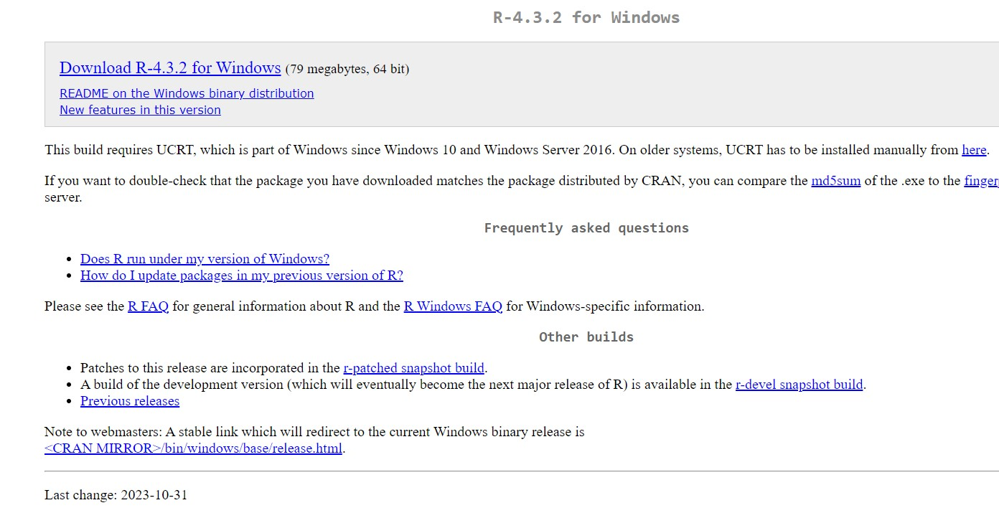
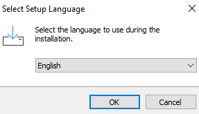
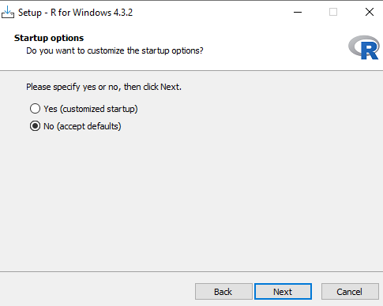
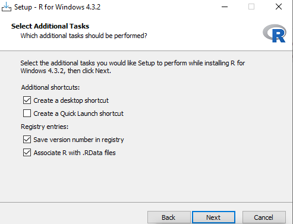
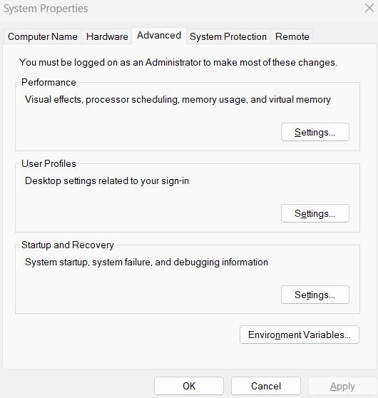

# Installing R on Windows

#### Authors : Dr. Chris Kypridemos, Dr. Anna Head, Adithi R. Upadhya

- The installation procedure outlined here pertains to versions R 4.3.2. 

- The installation process for R has exhibited notable consistency throughout the years.

### Steps to install R on Windows

1. To install R navigate to [CRAN](https://cran.rstudio.com/)

2. Click **Download R for Windows** 

3. Once you click it, click on **install R for the first time**

4. Now click on **Download R-4.3.2 for Windows**

5. Double click on the downloaded *.exe* file which is the setup file, Click **Yes** (accept defaults)

6. Select the language needed, here we have chosen here **English**, the default one

7. Select default features, Click **Next** 

8. Click **Next** again to install using default settings and default location, you can also browse to another folder if required

9. Then click **Next**  to install the following components

10. Check **No**  for default start up options and click **Next** 

11. Click **Next** to select the start Menu folder (accept default)

12. Check on whichever options you need and click on **Next**

13. Wait for the installation process

14. Once completed this following window will show up, Click **Next**. Now we need to add paths of R in the system variables

15. Type Environment variables in search bar of your Windows system, click on **Edit Environment Variables**

16. Click on New  and then add the variable name **PATH** and the value as *C:\\Program Files\\R-4.3.2\\bin* which is the path where bin folder or the Rscript.exe is stored e.g : *R4.3.2->bin->Rscript.exe*, click **Apply**

19. To check Rscript works on command prompt or console or terminal, go to the search bar in Windows system, type **cmd** and then click on command prompt / console / terminal. Once it opens, type `Rscript` in terminal and you should be able to see this

