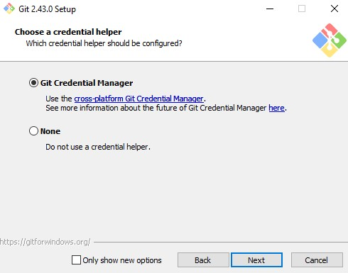
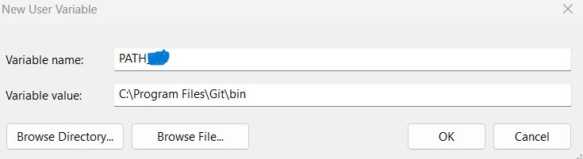

# Installing Git on Windows /Linux and opening a GitHub account

#### Authors : Dr. Chris Kypridemos, Dr. Anna Head, Adithi R. Upadhya


- The installation procedure outlined here pertains to versions Git 2.43.0. 

Installation steps for : 

- R in [Windows](installing_R_on_windows.md) / [Linux](installing_R_on_linux.md)
- RStudio in [Windows](installing_RStudio_on_windows.md)
- Rtools in [Windows](installing_rtools_on_windows.md)

### Steps to install Git on Windows

1. To use github we need to have git installed in your system. Navigate to [Git](https://git-scm.com/downloads) and click on **Download for Windows**


2. After you click the link you will be directed to another page - click on **Click here to download**


3. After the file is downloaded, double click on it and this window opens, click **Yes**, click on all default options after this step


4. Click **Next** 


5. Click **Next** 


6. Click **Next**


7. Click **Next** 


8. Click **Next** 


9. Click **Next**


10. Click **Next**


11. Select **Windows` default console window** and Click **Next**


12. Click **Next**


13. Click **Next**




14. Click **Next**


15. Click **Install** and wait for sometime


16. After the installation, it shows a window, click **Finish**, to check the correct installation, add path of git on your system

17. Type Environment variables in search bar of your Windows system, click on Environment Variables


18. Click on New  and then add the variable name as **PATH** and the value as *C:\\Program Files\\Git\\bin* where bin folder is installed in the Git folder, click **Apply**




19. To check Git works on command prompt or console, go to the search bar in Windows, type **cmd** and then click on command prompt / terminal. Once it opens, type `git` and it should show the following result


#### Opening a Github account

1. Navigate to [GitHub sign up](https://github.com/signup), add your email ID, password, and username


2. Select **Continue** and select **Continue for Free** 

3. After this we will need a **Personal Access Token** (like a password) to use github resources. To create a PAT follow these steps in RStudio console [(reference)](https://happygitwithr.com/https-pat): 
  - In RStudio console, typing `usethis::create_github_token()`, will open this [link](https://github.com/settings/tokens) -> Generate new token
  
 

  - the usethis approach takes you to a pre-filled form where we have pre-selected some recommended scopes, which you can look over and adjust before clicking "**Generate token**". At the time of writing, the `usethis` - recommended scopes are "repo", "user", "gist", and "workflow"
  - add **Note** and **Expiration** (best practice to keep it as 30 days)
  - store your PAT in a secure, long-term system for storing secrets, like 1Password or LastPass or store for a few minutes by copying on clipboard
  - call an R function to store your credentials : `gitcreds::gitcreds_set()`; and when prompted paste the PAT there
  
  - You can check the uploaded PAT using `gitcreds::gircreds_get()`
  - You are going to be re-generating and restoring your PAT on a schedule dictated by its expiration period. By default, once per month.
 - When the PAT expires, return to the GitHub token and click on its Note. At this point, you can optionally adjust scopes and then click "Regenerate token". You can optionally modify its Expiration and then click "Regenerate token" (again). As before, copy the PAT to the clipboard, call `gitcreds::gitcreds_set()`, and paste!
 - In Linux this PAT is stored temporarily and hence when installing assets we recommend setting your Linux PAT using `gitcreds::gitcreds_set()`


### Steps to install Git on Linux (Ubuntu) 

1. Run these commands in the terminal 

```{r}
$ sudo apt-get update 
$ sudo apt-get install git-all
$ git version
```
