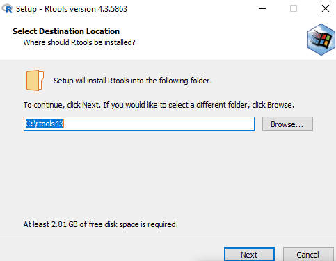
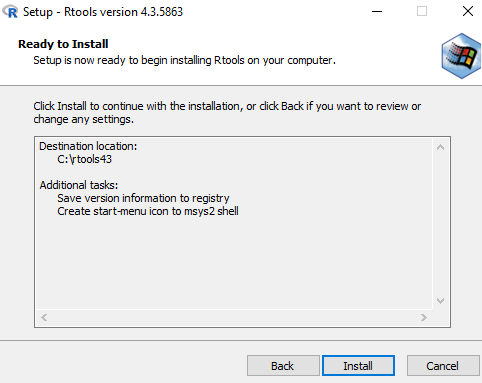

# Installing RTools on Windows

#### Authors : Dr. Chris Kypridemos, Dr. Anna Head, Adithi R. Upadhya

- The installation procedure outlined here pertains to versions RTools 4.3. 

### Steps to install RTools on Windows


1. Navigate to [RTools](https://cran.r-project.org/bin/windows/Rtools/), click on **RTools4.3** and once downloaded, double click on the .exe file


2. [Read Me](https://cran.r-project.org/bin/windows/Rtools/rtools43/rtools.html) (Please read this carefully <5 minutes read)

3. Click **Yes** (accept defaults)


4. Select a location to store Rtools and its files, or use the defaults, Click **Next** 




5. Click **Next** 


6. Click **Install** 




7. Wait for the installation process


8. Click **Finish** 


9. To check correct installation of Rtools, install the package devtools using the command in RStudio console and to load the library installed use `find_rtools()` if it says TRUE then Rtools has been installed correctly

```{r, check-rtools, eval = FALSE}
install.packages("devtools")
library(devtools)
find_rtools()
# TRUE
```


